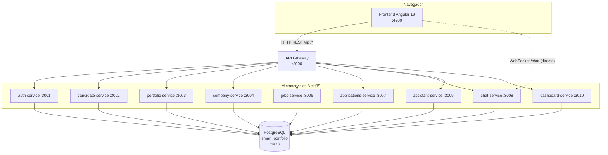
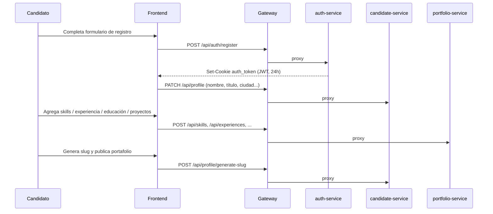
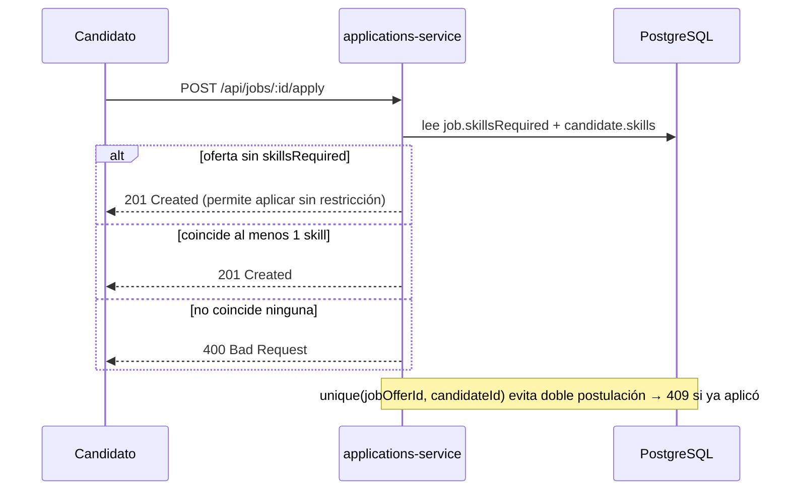

# Arquitectura técnica — TalentBridge V3

Ver también el documento previo [`arquitectura.md`](./arquitectura.md) (más orientado a decisiones de diseño) y [`endpoints.md`](./endpoints.md) (listado de rutas). Este documento se enfoca en *cómo* está armado y *cómo fluyen* las operaciones reales.

## 1. Vista de componentes

**Regla de comunicación**: el frontend solo conoce el Gateway (más el chat-service para WebSocket). Ningún microservicio se llama a sí mismo entre pares — toda orquestación cruzada, si hace falta, la hace el Gateway o el propio frontend con dos llamadas.

## 2. Frontend Angular

- Standalone components (sin `NgModule`), lazy-loaded por ruta (`loadComponent`).
- Dos shells (`AppShellComponent` para candidato, `CompanyShellComponent` para empresa) protegidos por `CandidateGuard`/`CompanyGuard` — un usuario logueado con el rol equivocado es redirigido, no bloqueado con error.
- `AuthInterceptor` global agrega `withCredentials: true` a cada request (para que viaje la cookie `auth_token`) y fuerza logout si el backend responde 401 fuera de rutas públicas.
- Detalle completo de estructura, rutas, servicios y convenciones visuales: [`FRONTEND_GUIDE.md`](./FRONTEND_GUIDE.md).

## 3. Backend NestJS (monorepo)

- Un `nest-cli.json` con 10 `apps/*` + 5 `libs/*` compartidas (`auth`, `database`, `common`, `contracts`, `events`).
- Cada microservicio es un proceso Nest independiente (`main.ts` propio, puerto propio) — se puede levantar con `nest start <app> --watch` o dockerizarlo con `Dockerfile` multi-stage (`target: <app>`).
- Autenticación: `JwtStrategy` (`libs/auth`) lee el JWT primero de la cookie `auth_token`, si no existe intenta `Authorization: Bearer`. `RolesGuard` + `@Roles()` decorator restringen por `UserRole` (`CANDIDATE`/`COMPANY`) consultando la tabla `users` en cada request.
- Respuestas estandarizadas vía `ResponseHelper` (`libs/common`): `success`, `created`, `paginated` — mismo shape `{ statusCode, message, data }` en (casi) todos los endpoints.
- Detalle completo por servicio: [`BACKEND_GUIDE.md`](./BACKEND_GUIDE.md).

## 4. API Gateway

- Único punto de entrada HTTP para el frontend (`/api/*`).
- Hace **proxy HTTP con `fetch` nativo** (`http-client.service.ts`) hacia el microservicio correspondiente — sin librería de gateway adicional (no Kong, no gRPC).
- Forwarding de cookies y headers de auth entre frontend↔microservicio.
- Swagger centralizado en `/api/docs`.
- No tiene lógica de negocio propia más allá de routing/proxy/CORS/health-check.

## 5. Base de datos

- PostgreSQL 16 único (`smart_portfolio`), Prisma ORM centralizado en `libs/database` (cliente generado en `libs/database/src/generated`, no en `node_modules`).
- **Fase actual**: schema compartido, cada servicio toca solo las tablas de su dominio por convención (no hay aislamiento físico).
- **Evolución planeada** (no implementada): separar en `auth_db`, `profiles_db`, `company_db`, `jobs_db`, `chat_db`.
- Modelo completo, relaciones y seeds: [`DATABASE.md`](./DATABASE.md).

## 6. Docker

- `docker-compose.yml` en la raíz del repo (no dentro de `BACKEND/`) define Postgres + los 10 servicios backend. El frontend **no** está en el compose — se corre con `npm start` aparte.
- **Proyecto Docker: `version3`** (`docker compose -p version3 ...`). Existe un proyecto Docker anterior ("version1") en la misma máquina para una versión previa del sistema — **nunca** operar sobre él ni sobre sus contenedores/volúmenes.
- Contenedor de base de datos: `smart_portfolio_db_v3`, volumen `pgdata_v3`, red `talentbridge_net`. Puerto host `5433` → interno `5432` (para no chocar con un Postgres local u otro proyecto).
- Reglas operativas completas (qué no hacer) en [`CLAUDE.md`](../CLAUDE.md).

## 7. Flujo — Candidato

El **porcentaje de perfil completado** (usado en el dashboard y en el checklist "Completá tu perfil" del frontend) se calcula en `candidate-service` (`profile.service.ts`, `getProfile`): 25% por cada uno de 4 bloques — datos básicos, ≥1 skill, experiencia-o-educación, ≥1 proyecto. Si se cambia esa regla, hay que actualizar el checklist del frontend en paralelo (`shared/components/profile-checklist/`) — hoy están duplicadas, no leídas de un solo lugar.

## 8. Flujo — Empresa

Registro → login (`role: COMPANY`, rechaza cuentas `CANDIDATE` con 403 y viceversa) → completar perfil empresarial (`company-service`) → publicar ofertas (`jobs-service`, ciclo `DRAFT → PUBLISHED → CLOSED/ARCHIVED`, con `restore` desde `ARCHIVED` a `DRAFT`) → buscar candidatos por skills/ciudad/profesión (`company-service`, endpoint de búsqueda con filtros `ANY`/`ALL`) → contactar por chat o revisar postulaciones recibidas.

## 9. Flujo — Postulaciones

Estados de postulación: `PENDING → REVIEWED → PRESELECTED / REJECTED → HIRED` (la empresa los cambia manualmente, no hay transición automática). Traducción a texto/color centralizada en frontend: `statusToLabel` / `statusToTone` (`shared/components/badge/`).

## 10. Flujo — Chat

- REST para historial (`GET/POST /api/chat/conversations`, mensajes, marcar leído, contador de no leídos) vía Gateway.
- **Tiempo real por WebSocket directo** `frontend → chat-service:3008` (namespace `/chat`), sin pasar por el Gateway — es la única excepción a la regla "el frontend solo conoce el Gateway". Autenticación del socket vía la misma cookie JWT.
- Eventos: `chat:message`, `chat:read`, `chat:unread-count`, `chat:conversation-updated`.
- Bloqueo entre usuarios (`ChatBlock`): unidireccional, un usuario puede bloquear la conversación sin que el otro se entere del bloqueo hasta intentar escribir.

## 11. Flujo — CV

Candidato sube PDF (`POST /api/cv/upload`, máx. 5MB, guardado en `BACKEND/uploads/cv/`) → `portfolio-service` extrae texto → `CvAnalysis` (score + fortalezas + recomendaciones) queda asociado al `CvDocument`. El análisis hoy es determinístico/basado en reglas simples sobre el texto extraído (no hay integración con un LLM externo) — si eso cambia, documentarlo en [`DECISIONS.md`](./DECISIONS.md).

## 12. Flujo — Portafolio público

- `GET /api/portfolio/:slug` (público, sin auth) — respeta cada switch de visibilidad (`showPhone`, `showCity`, `showLinkedin`, `showGithub`, `showWebsite`, `showExperience`, `showEducation`, `showProjects`, `showSkills`).
- `GET /api/portfolio/preview/me` (autenticado) — mismo contenido pero para que el propio candidato se vea antes de compartir el link.
- Frontend: ambos endpoints alimentan el mismo componente de render compartido `shared/components/portfolio-content/` (ver Fase 4.3 en [`plan-mejoras-frontend-ux.md`](./plan-mejoras-frontend-ux.md)) — **si necesitás cambiar cómo se ve una sección del portafolio, tocá ese único componente**, no los dos wrappers (`public-portfolio` / `public-preview`) por separado.
