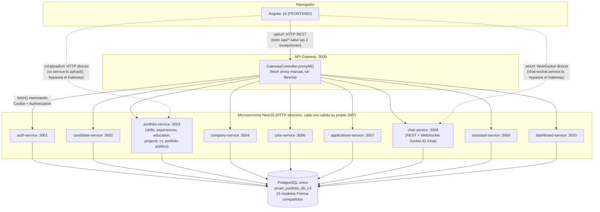

# Arquitectura real de TalentBridge V3 — auditoría verificada

> Documento generado a partir de lectura directa del código fuente del repositorio, no de la documentación previa (`BACKEND/MICROSERVICES.md`, `docs/ARCHITECTURE.md`, etc.). Donde este documento contradice a esos otros, es porque se verificó contra el código y se encontró una diferencia — se señala explícitamente en cada caso. Toda afirmación técnica incluye un bloque de evidencia con archivo, clase/método y líneas. Donde no se encontró evidencia suficiente, se indica literalmente.

---

## 1. Estilo arquitectónico — qué es realmente este sistema

### 1.1 Microservicios + API Gateway (confirmado)

El backend es un monorepo NestJS con **10 aplicaciones independientes** bajo `BACKEND/apps/` (una por dominio de negocio) más un API Gateway que centraliza el punto de entrada. Cada servicio es un proceso Nest distinto, con su propio `main.ts` y su propio puerto.

Evidencia:
- Archivo: `BACKEND/package.json`
- Método/clase: scripts `start:gateway`, `start:auth`, `start:candidate`, `start:portfolio`, `start:company`, `start:jobs`, `start:applications`, `start:chat`, `start:assistant`, `start:dashboard`
- Líneas: 16-25

Evidencia (puertos, un contenedor Docker por servicio):
- Archivo: `docker-compose.yml`
- Líneas: 20-186 (10 servicios: `api-gateway` 3000, `auth-service` 3001, `candidate-service` 3002, `portfolio-service` 3003, `company-service` 3004, `jobs-service` 3006, `applications-service` 3007, `chat-service` 3008, `assistant-service` 3009, `dashboard-service` 3010)

### 1.2 Comunicación entre servicios: 100% HTTP síncrona, sin cola de mensajes

Se revisó específicamente `BACKEND/libs/events/src` porque es el candidato obvio a un mecanismo de mensajería asíncrona. El resultado es concluyente: **ese paquete no implementa ningún broker de eventos**. Contiene únicamente:

- Un objeto de constantes `Events` con nombres de eventos como strings (`'chat:message'`, `'application:status-changed'`, `'job:published'`, etc.)
- Interfaces TypeScript de payload (`ChatMessagePayload`, `ApplicationStatusPayload`, `JobEventPayload`, `NotificationPayload`)

Evidencia:
- Archivo: `BACKEND/libs/events/src/index.ts`
- Líneas: 1-41 (archivo completo — no hay clases, no hay publishers/subscribers, no hay conexión a ningún broker)

No existe ninguna dependencia de mensajería en el proyecto (no `amqplib`, no `kafkajs`, no `ioredis`/`redis`, no `bullmq`, ni siquiera el paquete `@nestjs/microservices` que NestJS provee para transportes internos):

Evidencia:
- Archivo: `BACKEND/package.json`
- Líneas: 57-113 (`dependencies` + `devDependencies` completas — la única librería de red/tiempo real presente es `socket.io` para el chat)

Y, más importante: **el objeto `Events` nunca se importa fuera de sí mismo.** Se buscó `@app/events` (el alias del path del paquete) en todo `BACKEND/` y las únicas coincidencias son la declaración del alias en configuración, no un uso real:

Evidencia:
- Búsqueda: `@app/events` en `BACKEND/` → únicamente aparece en `BACKEND/package.json:127` (mapeo de Jest) y `BACKEND/tsconfig.json` (path alias). Ningún archivo de `apps/*/src` importa `@app/events`.

La propia documentación previa del backend (`BACKEND/MICROSERVICES.md`) es honesta al respecto y lo confirma:

Evidencia:
- Archivo: `BACKEND/MICROSERVICES.md`
- Líneas: 278-280: *"Eventos (preparado para futuro): `libs/events` define nombres de eventos y payloads. Preparado para integrar RabbitMQ o Kafka."*

**Conclusión verificada: no existe comunicación asíncrona entre microservicios.** `libs/events` es un contrato de nombres/tipos preparado a futuro, sin implementación. Toda comunicación real entre servicios (y entre frontend y backend) es HTTP síncrono.

### 1.3 El Gateway es un proxy HTTP hecho a mano con `fetch`, no un framework de gateway

El "ruteo" del API Gateway no usa ningún paquete de proxy (no `http-proxy-middleware`, no `@nestjs/microservices`). Es un único controller con un catch-all (`@All('*path')`) que decide el servicio destino con una cadena de `if` sobre el path, y reenvía la petición con `fetch()` nativo de Node.

Evidencia:
- Archivo: `BACKEND/apps/api-gateway/src/gateway.controller.ts`
- Método/clase: `GatewayController.proxyAll()`
- Líneas: 9-73

Evidencia (mecanismo de reenvío):
- Archivo: `BACKEND/apps/api-gateway/src/http-client.service.ts`
- Método/clase: `HttpClient.proxy()`
- Líneas: 8-67 (reenvía cookie y header `Authorization`, hace `fetch(targetUrl, ...)`, y devuelve la respuesta tal cual — línea 43: `fetch(targetUrl, { method, headers, body })`)

El orden de los `if` importa: por ejemplo, `/api/jobs/:id/apply` matchea primero la regla específica de Applications Service (línea 48) antes que la regla general de `/api/jobs` hacia Jobs Service (línea 52); si se invirtiera el orden, el ruteo se rompería. Esto es una fragilidad propia de esta implementación manual, no de "microservicios con gateway" en general.

Evidencia:
- Archivo: `BACKEND/apps/api-gateway/src/gateway.controller.ts`
- Líneas: 48-53

### 1.4 Autenticación: JWT verificado de forma independiente en cada microservicio, no solo en el Gateway

El Gateway **no valida el JWT** — solo reenvía la cookie `auth_token` y el header `Authorization` tal como llegaron. La validación real ocurre en cada microservicio de destino, vía un `JwtAuthGuard` compartido (`@app/auth`, un `PassportStrategy` de tipo `jwt`) que cada controller aplica con `@UseGuards(JwtAuthGuard)`.

Evidencia (el Gateway no tiene guards, solo reenvía headers):
- Archivo: `BACKEND/apps/api-gateway/src/http-client.service.ts`
- Líneas: 15-21 (copia `Cookie` y `Authorization` sin inspeccionarlos)

Evidencia (cada servicio valida el JWT por su cuenta):
- Archivo: `BACKEND/libs/auth/src/jwt.strategy.ts`
- Método/clase: `JwtStrategy.validate()`
- Líneas: 6-29 (extrae el token de la cookie `auth_token` o del header Bearer, y lo verifica contra `process.env['JWT_SECRET']`)

Evidencia (ejemplo de uso en un controller de dominio):
- Archivo: `BACKEND/apps/portfolio-service/src/experiences.controller.ts`
- Líneas: 10, 16, 22, 28 (`@UseGuards(JwtAuthGuard)` en cada endpoint)

Esto significa que los 9 microservicios de negocio son, en la práctica, cada uno responsable de su propia autorización — no hay un punto central de autenticación real más allá de que todos comparten el mismo `JWT_SECRET` y la misma librería `@app/auth`.

### 1.5 WebSocket: un caso, y es genuinamente asíncrono/push, pero solo dentro de un mismo proceso

`chat-service` expone un `WebSocketGateway` de Socket.IO (namespace `/chat`) para push en tiempo real de mensajes nuevos, contador de no leídos y actualizaciones de conversación. Es el único mecanismo real de "tiempo real" del sistema.

Evidencia:
- Archivo: `BACKEND/apps/chat-service/src/chat.gateway.ts`
- Método/clase: `ChatGateway` (decorador `@WebSocketGateway`)
- Líneas: 26-32

Importante — este WebSocket **no es un bus de eventos entre microservicios**: es un canal cliente↔servidor dentro del propio `chat-service`. El flujo real es: `ChatController` (HTTP) recibe el mensaje → `ChatService.sendMessage()` lo persiste en Postgres → **en el mismo método**, `ChatService` llama directamente a los métodos de `ChatGateway` (inyectado por constructor, no vía evento) para emitir por socket a los clientes conectados.

Evidencia:
- Archivo: `BACKEND/apps/chat-service/src/chat.service.ts`
- Método/clase: `ChatService.sendMessage()`
- Líneas: 238-268 (persiste con `this.prisma.chatMessage.create(...)` en la línea 250, y recién después llama `this.chatGateway.sendMessageToConversation(...)` en la línea 261 — inyección directa de clase, línea 18: `private readonly chatGateway: ChatGateway`)

**Hallazgo — código muerto en el WebSocket del lado cliente.** `ChatSocketService` (Angular) expone métodos que emiten eventos `chat:send`, `chat:join`, `chat:leave`, `chat:typing`, `chat:read` hacia el servidor, pero `ChatGateway` (backend) **no tiene ningún `@SubscribeMessage`** — solo maneja `handleConnection`/`handleDisconnect` y emite eventos hacia el cliente, nunca escucha eventos del cliente.

Evidencia (frontend emite eventos que nadie escucha):
- Archivo: `FRONTEND/src/app/core/services/chat-socket.service.ts`
- Método/clase: `ChatSocketService.sendMessage()`, `.joinConversation()`, `.leaveConversation()`, `.sendTyping()`, `.markAsRead()`
- Líneas: 58-80 (todos usan `this.socket?.emit(...)`)

Evidencia (backend nunca declara un listener para esos eventos):
- Archivo: `BACKEND/apps/chat-service/src/chat.gateway.ts`
- Líneas: 1-163 (archivo completo — cero decoradores `@SubscribeMessage`; el propio comentario de la clase, líneas 16-25, documenta a propósito que es "principalmente push")

En la práctica esto no rompe nada porque el envío real de mensajes (`messages.component.ts`) usa `chatService.sendMessage()` (HTTP, línea 192 de `messages.component.ts`) y la recepción en vivo usa `chatSocket.message$` (que sí funciona, porque es el servidor emitiendo hacia el cliente). Pero los emits de `joinConversation`/`markAsRead`/`sendTyping` del lado cliente son, hoy, ruido sin efecto en el servidor.

### 1.6 Base de datos: un único Postgres compartido, ORM centralizado

Un solo contenedor Postgres (`smart_portfolio_db_v3`), un solo `schema.prisma` con 15 modelos + 3 enums, cliente Prisma generado una vez en `BACKEND/libs/database/src/generated` e importado por los 10 servicios vía `PrismaModule`/`PrismaService`. No hay separación de base de datos por servicio (ni siquiera por schema).

Evidencia:
- Archivo: `docker-compose.yml`, líneas 1-16 (un solo servicio `postgres`)
- Archivo: `BACKEND/prisma/schema.prisma`, líneas 11-352 (`generator client` con `output = "../libs/database/src/generated"`, y 15 `model` + 3 `enum` listados de línea 16 a 352)

---

## 2. Diagrama de arquitectura real

Solo se incluyen los caminos confirmados leyendo `FRONTEND/src/environments/environment*.ts` y los servicios Angular en `FRONTEND/src/app/core/services/*.ts`. La regla general es "todo pasa por el Gateway"; hay exactamente **dos excepciones confirmadas**: el WebSocket del chat y la subida de CV.

Evidencia (las tres URLs base del frontend y por qué existen dos excepciones):
- Archivo: `FRONTEND/src/environments/environment.ts`
- Líneas: 1-8 (`apiUrl` → gateway `:3000/api`; `wsUrl` → chat-service directo `:3008`; `cvUploadUrl` → portfolio-service directo `:3003`, con comentario explícito en la línea 6: *"portfolio-service directo (subida de CV, bypassea el gateway)"*)
- Archivo: `FRONTEND/src/environments/environment.prod.ts`
- Líneas: 1-17 (mismo patrón en producción, con dominios Render separados para `chat-service` y `portfolio-service` porque el plan free de Render no soporta servicios privados — comentario líneas 3-16)

Evidencia (uso de `cvUploadUrl` en el único servicio Angular que lo usa):
- Archivo: `FRONTEND/src/app/core/services/cv.service.ts`
- Líneas: 15-18, 23-29 (`uploadApi` construido con `environment.cvUploadUrl`, usado solo en `upload()`; el resto de métodos de la misma clase — `getAll`, `getOne`, `analyze`, `getAnalyses` — sí usan `this.api`, que sale de `environment.apiUrl`, es decir pasan por el Gateway)

Evidencia (uso de `wsUrl` en el único servicio Angular que lo usa):
- Archivo: `FRONTEND/src/app/core/services/chat-socket.service.ts`
- Línea: 38 (`io(\`${environment.wsUrl}/chat\`, ...)`)

Todos los demás servicios Angular revisados (`profile.service.ts`, `experiences.service.ts`, `jobs.service.ts`, `chat.service.ts` para las rutas REST, `dashboard.service.ts`, `education.service.ts`, `skills.service.ts`, `projects.service.ts`, `company.service.ts`, `public-portfolio.service.ts`, `assistant.service.ts`) construyen su URL base a partir de `environment.apiUrl` únicamente — es decir, pasan por el Gateway.

---

## 3. Flujo de una solicitud, paso a paso (7 casos)

Para cada caso: componente Angular → método del servicio Angular → endpoint → controller backend → método del service backend → tablas Prisma tocadas → forma de la respuesta.

### 3.1 Inicio de sesión (login candidato)

1. **Componente**: `LoginComponent.onSubmit()` — `FRONTEND/src/app/features/auth/login.component.ts`, líneas 109-120. Normaliza el email (`normalizeEmail`) y llama `this.auth.login(...)`.
2. **Servicio Angular**: `AuthService.login()` — `FRONTEND/src/app/core/auth/auth.service.ts`, líneas 74-79. `POST ${environment.apiUrl}/auth/login` con `{ email, password }`, `withCredentials: true`. Al recibir respuesta, guarda el usuario en el signal `_currentUser` y el token en `localStorage` (`setToken`, línea 78).
3. **Endpoint del gateway**: `POST /api/auth/login` → matchea `fullPath.startsWith('/api/auth')` en `GatewayController.proxyAll()`, reenviado a `AUTH_SERVICE_URL` (`http://localhost:3001` por defecto). Evidencia: `BACKEND/apps/api-gateway/src/gateway.controller.ts`, líneas 13-14.
4. **Controller backend**: `AuthController.login()` — `BACKEND/apps/auth-service/src/auth.controller.ts`, líneas 31-39. Llama `authService.login(dto)` y luego `setAuthCookie(res, token)` (cookie httpOnly `auth_token`, 24h, líneas 72-80).
5. **Service backend**: `AuthService.login()` — `BACKEND/apps/auth-service/src/auth.service.ts`, líneas 91-114. Busca el `User` por email normalizado (incluye `profile` y `companyProfile`), compara el hash con `bcrypt.compare`, verifica `role === UserRole.CANDIDATE` (rechaza cuentas de empresa con 403 — línea 106-110), genera el JWT con `jwtService.sign({ sub, email, role })`.
6. **Tablas Prisma tocadas**: `User` (lectura, `findUnique` por `email`) — con `include: { profile: true, companyProfile: true }`, por lo que también lee `Profile` y `CompanyProfile` en el mismo query.
7. **Forma de la respuesta**: `{ user: <User sin passwordHash, con profile/companyProfile embebidos>, token: string }` — más el header `Set-Cookie: auth_token=...`. Evidencia: `BACKEND/apps/auth-service/src/auth.controller.ts`, línea 38; `sanitizeUser()` en `auth.service.ts`, líneas 158-171 (quita `passwordHash` del objeto devuelto).

### 3.2 Consulta del perfil propio

1. **Componente**: cualquier pantalla del shell candidato que necesite el perfil (ej. `profile`, `skills`, `public-view`) llama a `ProfileService.getProfile()`. No hay un único componente de origen — el servicio está diseñado para ser consumido desde varios.
2. **Servicio Angular**: `ProfileService.getProfile()` — `FRONTEND/src/app/core/services/profile.service.ts`, líneas 24-31. `GET ${environment.apiUrl}/profile`, cacheado en memoria con `shareReplay(1)` (`profileCache$`) para que llamadas repetidas desde distintas pantallas no dupliquen el HTTP request.
3. **Endpoint del gateway**: `GET /api/profile` → matchea `fullPath.startsWith('/api/profile')`, reenviado a `CANDIDATE_SERVICE_URL` (`:3002`). Evidencia: `gateway.controller.ts`, líneas 21-23.
4. **Controller backend**: `ProfileController.getProfile()` — `BACKEND/apps/candidate-service/src/profile.controller.ts`, líneas 10-14. Protegido por `JwtAuthGuard`; el `userId` sale de `@CurrentUser()` (el `sub` del JWT).
5. **Service backend**: `ProfileService.getProfile()` — `BACKEND/apps/candidate-service/src/profile.service.ts`, líneas 9-44. Un solo `findUnique` con `include` de `skills`, `experiences`, `educations`, `projects` y `views` (con datos de la empresa que vio el perfil). Calcula `completionPercentage` en memoria (25% por sección: datos básicos, skills, experiencia/educación, proyectos — líneas 34-38).
6. **Tablas Prisma tocadas**: `Profile` (lectura principal) + `Skill`, `Experience`, `Education`, `Project`, `ProfileView` (todas vía `include` en el mismo query, sin round-trips adicionales).
7. **Forma de la respuesta**: el objeto `Profile` completo con arrays embebidos `skills[]`, `experiences[]`, `educations[]`, `projects[]`, `views[]`, más el campo calculado `completionPercentage: number`.

### 3.3 Edición de experiencia laboral

1. **Componente**: `ExperiencesComponent.save()` — `FRONTEND/src/app/features/experiences/experiences.component.ts`, líneas 307-326. Según si `this.editing` tiene un id, llama `service.update(this.editing, data)` o `service.create(data)`.
2. **Servicio Angular**: `ExperiencesService.update()` / `.create()` — `FRONTEND/src/app/core/services/experiences.service.ts`, líneas 20-27. `POST`/`PATCH` a `${environment.apiUrl}/experiences[/:id]`.
3. **Endpoint del gateway**: matchea `fullPath.startsWith('/api/experiences')`, reenviado a `PORTFOLIO_SERVICE_URL` (`:3003`) junto con `/api/skills`, `/api/education`, `/api/projects`, `/api/cv`, `/api/portfolio`, `/api/analysis` — todos viven en el mismo microservicio `portfolio-service`. Evidencia: `gateway.controller.ts`, líneas 25-30.
4. **Controller backend**: `ExperiencesController.addExperience()` / `.updateExperience()` — `BACKEND/apps/portfolio-service/src/experiences.controller.ts`, líneas 17-26.
5. **Service backend**: `ExperiencesService.addExperience()` / `.updateExperience()` — `BACKEND/apps/portfolio-service/src/experiences.service.ts`, líneas 31-82. Antes de escribir, resuelve el `Profile` del usuario (`findUnique` por `userId`) para obtener `profileId`; normaliza texto (`titleCaseText`, `trimText`) y deduplica `learnedSkills` con `dedupeSkillList()` (líneas 6-16, case-insensitive preservando la primera capitalización).
6. **Tablas Prisma tocadas**: `Profile` (lectura, para resolver `profileId` y para validar propiedad en `updateExperience`) + `Experience` (`create` o `update`).
7. **Forma de la respuesta**: el registro `Experience` creado/actualizado tal cual lo devuelve Prisma (todos sus campos, incluido el `id` generado en el caso de `create`).

### 3.4 Consulta de empleos (listado)

1. **Componente**: `CandidateJobsComponent` (método que dispara la búsqueda) — `FRONTEND/src/app/features/jobs/candidate-jobs.component.ts`, línea 112: `this.jobsService.searchJobs(params).subscribe(...)`.
2. **Servicio Angular**: `JobsService.searchJobs()` — `FRONTEND/src/app/core/services/jobs.service.ts`, líneas 22-27. `GET ${environment.apiUrl}/jobs` con query params (`q`, `city`, `modality`, `contractType`, `skills`, `page`, `limit`).
3. **Endpoint del gateway**: para `/api/jobs` (sin `/apply` ni `/my-applications` en el path) matchea la regla general de línea 52 y va a `JOBS_SERVICE_URL` (`:3006`). Evidencia: `gateway.controller.ts`, líneas 48-53 (nota: hay una regla más específica antes, líneas 48-50, que desvía a Applications Service si el path incluye `/apply` o `/my-applications` — no aplica a este caso).
4. **Controller backend**: `CandidateJobsController.getJobs()` — `BACKEND/apps/jobs-service/src/candidate-jobs.controller.ts`, líneas 9-13.
5. **Service backend**: `JobsService.getCandidateJobs()` — `BACKEND/apps/jobs-service/src/jobs.service.ts`, líneas 147-205. Resuelve las skills del candidato (para calcular match), arma un `where` con `status: PUBLISHED` + filtros de texto/ciudad, pagina con `skip`/`take`, y por cada oferta calcula `computeSkillMatch()` (de `@app/contracts`) para anotar `matchedSkills`, `canApplyBySkills`, `hasApplied`.
6. **Tablas Prisma tocadas**: `Profile` (lectura), `Skill` (lectura, skills del candidato), `JobOffer` (`findMany` + `count`, con `include` de `company.companyProfile` y `applications` filtradas por el candidato actual).
7. **Forma de la respuesta**: `{ data: JobOffer[] (cada uno enriquecido con requiredSkillsList, matchedSkills, canApplyBySkills, skillMatch, hasApplied, applicationStatus, applicationId), meta: { page, limit, total, totalPages } }`.

### 3.5 Postulación a una vacante

1. **Componente**: `CandidateJobsComponent.applyToJob()` — `FRONTEND/src/app/features/jobs/candidate-jobs.component.ts`, líneas 257-278.
2. **Servicio Angular**: `JobsService.applyToJob()` — `FRONTEND/src/app/core/services/jobs.service.ts`, líneas 35-37. `POST ${environment.apiUrl}/jobs/${jobId}/apply` con `{ coverMessage? }`.
3. **Endpoint del gateway**: aquí el ruteo del Gateway se desvía del servicio "Jobs" al servicio "Applications" porque el path contiene `/apply`: `fullPath.startsWith('/api/jobs/') && fullPath.includes('/apply')` → `APPLICATIONS_SERVICE_URL` (`:3007`). Evidencia: `gateway.controller.ts`, líneas 48-50.
4. **Controller backend**: `ApplicationsController.apply()` — `BACKEND/apps/applications-service/src/applications.controller.ts`, líneas 23-27 (`POST jobs/:id/apply`).
5. **Service backend**: `ApplicationsService.apply()` — `BACKEND/apps/applications-service/src/applications.service.ts`, líneas 24-54. Cadena de validaciones: la oferta existe y está `PUBLISHED` (si no, 400); el candidato tiene `Profile` (si no, 400 "Completa tu perfil antes de aplicar"); no existe ya una `JobApplication` con el mismo `jobOfferId_candidateId` (constraint única — si existe, 409 `ConflictException`); y finalmente `computeSkillMatch()` sobre las skills del candidato vs. `job.skillsRequired` — si no hay ningún match, 400 `BadRequestException`.
6. **Tablas Prisma tocadas**: `JobOffer` (lectura), `Profile` (lectura), `JobApplication` (lectura para chequear duplicado + `create`), `Skill` (lectura, para el matching).
7. **Forma de la respuesta**: el registro `JobApplication` recién creado, con `status: PENDING` por defecto (`JobApplicationStatus.PENDING`, línea 51 de `applications.service.ts`).

### 3.6 Envío de un mensaje de chat

1. **Componente**: `MessagesComponent` (handler de envío) — `FRONTEND/src/app/features/messages/messages.component.ts`, línea 192: `this.chatService.sendMessage(conv.id, body).subscribe(...)`. El envío real es por HTTP, no por el socket — el socket (`chatSocket`) en este componente se usa solo para *recibir* mensajes en vivo (`chatSocket.message$.subscribe(...)`, línea 70) y para `markAsRead`/`joinConversation`, que como se documenta en la sección 1.5 no tienen efecto en el servidor.
2. **Servicio Angular**: `ChatService.sendMessage()` — `FRONTEND/src/app/core/services/chat.service.ts`, líneas 54-56. `POST ${environment.apiUrl}/chat/conversations/${conversationId}/messages` con `{ body }`.
3. **Endpoint del gateway**: `fullPath.startsWith('/api/chat')` → `CHAT_SERVICE_URL` (`:3008`). Evidencia: `gateway.controller.ts`, líneas 60-62.
4. **Controller backend**: `ChatController.sendMessage()` — `BACKEND/apps/chat-service/src/chat.controller.ts`, líneas 58-63.
5. **Service backend**: `ChatService.sendMessage()` — `BACKEND/apps/chat-service/src/chat.service.ts`, líneas 238-268. Valida pertenencia a la conversación y que el remitente no esté bloqueado (`ChatBlock`), persiste el `ChatMessage`, actualiza `lastMessageAt` de la `Conversation`, y **recién después** de persistir llama directamente a `ChatGateway` (inyectado, no por evento) para emitir por WebSocket: `sendMessageToConversation`, `notifyUnreadCount` (para ambos), `notifyConversationUpdated` (para ambos) — líneas 261-265.
6. **Tablas Prisma tocadas**: `Conversation` (lectura + `update` de `lastMessageAt`), `ChatBlock` (lectura, para chequear bloqueo), `ChatMessage` (`create`).
7. **Forma de la respuesta HTTP**: el registro `ChatMessage` creado (`id`, `conversationId`, `senderId`, `body`, `createdAt`, `readAt: null`). Adicionalmente, **fuera del ciclo request/response HTTP**, todos los sockets unidos a la room `conversation:<id>` reciben un evento `chat:message` con forma `{ id, conversationId, senderId, body, createdAt, readAt: null, isMine: false }` (armado en `ChatGateway.sendMessageToConversation()`, líneas 112-122 de `chat.gateway.ts`).

### 3.7 Consulta de dashboard candidato

1. **Componente**: `HomeCandidateComponent` (`ngOnInit`) — `FRONTEND/src/app/features/home-candidate/home-candidate.component.ts`, línea 67: `this.dashboardService.getCandidateDashboard().subscribe(...)`.
2. **Servicio Angular**: `DashboardService.getCandidateDashboard()` — `FRONTEND/src/app/core/services/dashboard.service.ts`, líneas 96-98. `GET ${environment.apiUrl}/dashboard/candidate`.
3. **Endpoint del gateway**: `fullPath.startsWith('/api/dashboard')` → `DASHBOARD_SERVICE_URL` (`:3010`). Evidencia: `gateway.controller.ts`, líneas 68-70.
4. **Controller backend**: `DashboardController.getCandidateDashboard()` — `BACKEND/apps/dashboard-service/src/dashboard.controller.ts`, líneas 9-13.
5. **Service backend**: `DashboardService.getCandidateDashboard()` — `BACKEND/apps/dashboard-service/src/dashboard.service.ts`, líneas 12-101. Es el flujo con más tablas tocadas de los 7: agrega, en un solo endpoint, el perfil, contadores de postulaciones y vistas, las 5 postulaciones más recientes, las 5 ofertas publicadas más recientes (sin relación con el candidato — son "sugerencias" generales), el conteo de mensajes no leídos, las 3 conversaciones más recientes, el % de perfil completo y un `nextStep` sugerido calculado con reglas en cascada (líneas 70-74: perfil incompleto → agregar skills → completar nombre → postular a la primera oferta → explorar más ofertas).
6. **Tablas Prisma tocadas**: `Profile` (con `skills`, `experiences`, `educations`, `projects` vía `include`), `JobApplication` (`count` + `findMany` de las 5 más recientes, con `jobOffer` embebido), `ProfileView` (`count`), `JobOffer` (`findMany` de las 5 más recientes publicadas), `Conversation` (`findMany`, dos veces: para contar conversaciones y para las 3 más recientes con su último mensaje), `ChatMessage` (`count` de no leídos).
7. **Forma de la respuesta**: objeto agregado `{ profilePercent, skillsCount, projectsCount, applicationsCount, unreadMessagesCount, profileViewsCount, isPublished, recentJobs[], recentApplications[], recentConversations[], nextStep: { label, action, route } }` — diseñado explícitamente para que el frontend no tenga que hacer varias llamadas a distintos microservicios y combinarlas él mismo (ver comentario en `FRONTEND/src/app/core/services/dashboard.service.ts`, líneas 84-88).

---

## 4. Ventajas y dificultades específicas de esta arquitectura para *este* proyecto

No son ventajas/dificultades genéricas de manual — son las que se observan puntualmente en este código.

### Ventajas verificadas

- **El Gateway como capa de resolución de ruteo cross-cutting es real y útil aquí**: casos como la postulación a una vacante (3.5) muestran que un mismo prefijo de URL (`/api/jobs/...`) puede resolver a dos microservicios distintos (`jobs-service` vs `applications-service`) según el sub-path, sin que el frontend necesite saberlo — el frontend solo conoce `environment.apiUrl`. Esto desacopla genuinamente el frontend de la topología interna.
- **Cada dominio de negocio es autónomo a nivel de código** (controller + service + DTOs propios por `apps/*`), lo cual se ve consistentemente en los 7 flujos: no hay imports cruzados entre `apps/portfolio-service` y `apps/jobs-service`, por ejemplo. La única dependencia compartida es a nivel de librería (`libs/database`, `libs/auth`, `libs/common`, `libs/contracts`), no de servicio a servicio.
- **`dashboard-service` demuestra el patrón "backend for frontend" bien aplicado**: en vez de que Angular dispare 5-6 llamadas a distintos microservicios para armar la pantalla de inicio, un solo servicio agrega todo (sección 3.7). Reduce round-trips del cliente a costa de que ese servicio conozca ligeramente los modelos de otros dominios (acoplamiento de lectura, no de escritura).

### Dificultades verificadas

- **El Gateway es un único punto de fallo hecho con `fetch` + `if` en cadena, sin resiliencia.** `HttpClient.proxy()` no tiene timeout explícito, reintentos, circuit breaker ni caché — si un microservicio de destino no responde, el único manejo es un `catch` genérico que devuelve 502 (`http-client.service.ts`, líneas 60-66). En una demo esto es aceptable; en producción real sería un problema, porque **todo** el tráfico (salvo las dos excepciones de la sección 2) pasa por este único proceso Node.
- **El orden de las reglas de ruteo en `GatewayController.proxyAll()` es frágil por construcción**: al ser una cadena secuencial de `if (fullPath.startsWith(...))`, agregar un nuevo microservicio o un nuevo prefijo de ruta exige entender el orden exacto de las 12 reglas existentes para no romper un caso ya andando (ejemplo concreto: la regla de `/api/company/jobs/:id/applications` en las líneas 32-34 tiene que evaluarse *antes* que la regla general de `/api/company/jobs` en las líneas 40-42, o toda postulación por oferta iría al microservicio equivocado). No hay tests automatizados de este archivo que se hayan detectado en la exploración.
- **La autenticación duplicada (JWT verificado en cada uno de los 9 microservicios de negocio) multiplica el código a mantener** si cambia la lógica de autorización — hoy se comparte vía `@app/auth`, lo cual mitiga el problema, pero cualquier cambio en `JwtStrategy` requiere redeployar los 9 servicios, no solo el Gateway.
- **`libs/events` es una promesa sin cumplir que puede confundir a quien lea el código por primera vez**: existe una carpeta entera dedicada a "eventos" con nombres que sugieren un sistema pub/sub real (`APPLICATION_STATUS_CHANGED`, `NEW_APPLICATION`, `JOB_PUBLISHED`, `NOTIFICATION_CREATED`), pero ningún flujo de negocio los dispara. Por ejemplo, cuando un candidato se postula (3.5) o una empresa cambia el estado de una postulación (`ApplicationsService.updateStatus()`), no se emite ningún evento `NEW_APPLICATION` ni `APPLICATION_STATUS_CHANGED` — el candidato no tiene forma de enterarse en tiempo real de que su postulación cambió de estado, a diferencia del chat (que sí tiene push real vía WebSocket). Si el proyecto necesita esa notificación en tiempo real a futuro, hay que construir el mecanismo — hoy solo existen los nombres.
- **El caso del WebSocket documentado en la sección 1.5** (métodos del cliente que emiten eventos que el servidor no escucha) es evidencia de una interfaz cliente/servidor que se dejó a medio conectar: no rompe el flujo actual porque el envío real es por HTTP, pero es deuda técnica concreta — cualquiera que lea solo `chat-socket.service.ts` asumiría razonablemente que `sendMessage()` envía el mensaje.
- **Base de datos única y compartida entre los 10 servicios** (sección 1.6) significa que, pese a la separación de código, no hay aislamiento real de datos entre microservicios: cualquier servicio con acceso al `PrismaService` puede leer/escribir cualquier tabla, no solo las de "su" dominio. La propia documentación previa lo reconoce como "Fase 1" con una evolución futura a bases separadas (`BACKEND/MICROSERVICES.md`, líneas 250-264) que no se ha implementado.

---

## 5. Resumen de la pregunta clave: ¿síncrono o asíncrono?

**Síncrono HTTP en el 100% de los flujos de negocio** (los 7 casos trazados en la sección 3, sin excepción). El único componente genuinamente asíncrono/push del sistema es el WebSocket del chat (sección 1.5), y es un canal cliente↔servidor de un solo microservicio (`chat-service`), no un bus de eventos entre microservicios. No hay cola de mensajes, no hay broker, no hay `EventEmitter2` interno de NestJS en uso, y el paquete `libs/events` que sugiere lo contrario está sin conectar a ningún flujo real — confirmado por búsqueda exhaustiva de sus imports en todo `BACKEND/apps`.
