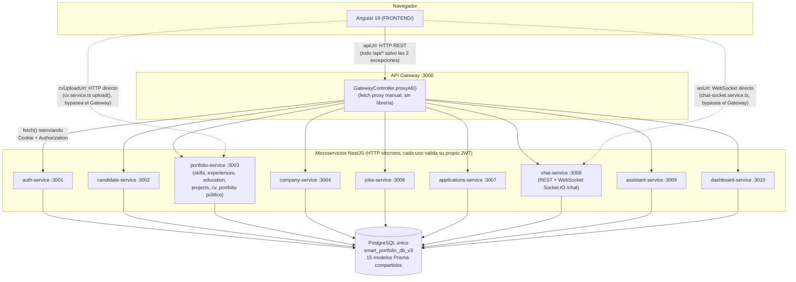

# Documentación técnica — TalentBridge V3

> Documento maestro de síntesis. Consolida el contenido de 6 documentos de auditoría técnica generados a partir de lectura directa del código fuente del repositorio (no de suposiciones ni de documentación previa sin verificar). Cada sección remite al documento de origen para el detalle línea-por-línea; este documento resume y estructura, no reemplaza la evidencia completa.
>
> Fecha de consolidación: 2026-07-18. Fuente: los 6 documentos de auditoría listados en el Anexo, más verificación puntual adicional (`package.json`, estructura de carpetas) hecha para esta síntesis.

---

## 1. Portada + ficha técnica

| Campo | Valor |
|---|---|
| Nombre del proyecto | TalentBridge V3 |
| Versión (backend) | `3.0.0` — `BACKEND/package.json`, campo `version` |
| Versión (frontend) | `0.0.0` — `FRONTEND/package.json`, campo `version` (no incrementada desde el scaffold de Angular CLI; no hay evidencia de un esquema de versionado semántico activo en el frontend) |
| Tipo de aplicación | Plataforma web full-stack de conexión laboral (SPA + API de microservicios) |
| Propósito | Conectar candidatos y empresas mediante portafolio profesional, búsqueda de talento, ofertas de trabajo, postulaciones, mensajería y un asistente virtual con IA — construida como demo académica de arquitectura de microservicios (Seminario UCC 2026) |
| Usuarios objetivo | Dos roles excluyentes: **Candidato** (`UserRole.CANDIDATE`) y **Empresa** (`UserRole.COMPANY`) |
| Estado actual | Funcional de punta a punta en los flujos principales (verificado en vivo, ver secciones 13-14 y 18); sin suite de tests automatizados; con deuda técnica y riesgos de seguridad documentados (sección 19) |
| Arquitectura general (1 línea) | Microservicios NestJS (10 servicios) detrás de un API Gateway propio, comunicación 100% HTTP síncrona, base de datos PostgreSQL única compartida, frontend Angular SPA consumiendo todo a través del Gateway salvo 2 excepciones (WebSocket de chat y subida de CV) |
| Tipo de repositorio | Repositorio único (monorepo del proyecto completo) que contiene dos sub-proyectos independientes: `BACKEND/` (monorepo NestJS con 10 apps + 5 libs compartidas, un solo `package.json`) y `FRONTEND/` (proyecto Angular standalone, `package.json` propio) — no son monorepos anidados con gestor compartido (no hay Lerna/Nx/Turborepo, ni `package.json` en la raíz del repo) |
| Sistemas operativos compatibles | No se encontró evidencia de restricción de SO en el código (Node.js + Docker son multiplataforma). El único artefacto específico de un SO es `iniciar-talentbridge.bat` (Windows, automatiza el arranque completo). La `docs/GUIA_INSTALACION_TALENTBRIDGE_V3.md` no documenta un equivalente `.sh` para Linux/macOS — quien use otro SO debe ejecutar los comandos manuales (sección 21) uno por uno |
| Forma principal de ejecución | Desarrollo local: Docker Compose (solo Postgres) + los 10 microservicios y el frontend corridos manualmente con `npm run start:*` / `npm start` (o todo automatizado vía `iniciar-talentbridge.bat` en Windows). Producción: backend en **Render** (10 servicios web + base de datos externa, probablemente Supabase — no confirmado con certeza), frontend en **Vercel** |

---

## 2. Resumen ejecutivo

TalentBridge V3 es una plataforma de conexión laboral candidato↔empresa con portafolio profesional inteligente. Un candidato construye su perfil (datos básicos, habilidades, experiencia, educación, proyectos, CV), lo publica como portafolio público en `/portfolio/:slug`, aplica a ofertas de trabajo y conversa con empresas. Una empresa publica vacantes, busca candidatos con filtros, gestiona postulaciones y conversa con los perfiles de interés. Ambos roles cuentan con un asistente virtual con IA real ("Joaquín") y un dashboard de métricas.

El sistema se construyó deliberadamente como **microservicios reales, no un monolito disfrazado**: 10 aplicaciones NestJS independientes (cada una con su propio proceso, puerto y `main.ts`) detrás de un API Gateway que centraliza el punto de entrada del frontend. La comunicación entre el Gateway y cada microservicio es HTTP síncrono vía `fetch()` nativo (no hay cola de mensajes ni bus de eventos real, pese a existir una librería `libs/events` preparada para ese futuro). Los 10 servicios comparten una única base de datos PostgreSQL con un solo `schema.prisma` — no hay separación de datos por dominio ("database per service" no implementado). El único mecanismo genuinamente asíncrono/push del sistema es el WebSocket del chat, y opera dentro de un solo microservicio (`chat-service`), no como bus entre servicios.

El estado general, verificado con evidencia real (no solo "compila"), es que **los flujos principales funcionan de punta a punta** — login, perfil, habilidades, experiencia, empleos, postulaciones, chat en tiempo real, dashboard y asistente fueron todos trazados componente→base de datos y probados en vivo durante el desarrollo (ver dificultades documentadas en la sección 13). Al mismo tiempo, el proyecto **no tiene ninguna suite de tests automatizados de negocio** (ni backend ni frontend, sección 16) y tiene deuda técnica/riesgos de seguridad concretos y documentados (sección 19), no hipotéticos.

### Tabla de estado por área

| Área | Estado comprobado | Evidencia |
|---|---|---|
| Frontend | Funcional | Rutas, guards por rol, formularios y responsive verificados contra código real; múltiples bugs de UX encontrados y corregidos en vivo (secciones 13-14). Sin suite de tests de negocio. |
| Gateway | Parcialmente funcional | Enruta correctamente los 7 flujos trazados (sección 3), pero tiene 3 reglas de proxy sin destino real (`/api/health`, `/api/analysis`, `/api/applications`), un bug latente de pérdida de body en subidas `multipart/form-data`, y cero resiliencia (sin timeout/retry/circuit breaker) — `INVENTARIO_MICROSERVICIOS_TALENTBRIDGE_V3.md`, sección 2.1. |
| Autenticación | Funcional | Login/registro candidato y empresa verificados en vivo; bug crítico de cookies cross-domain (bloqueaba el acceso completo en producción) encontrado y solucionado — `DIFICULTADES_Y_SOLUCIONES_TALENTBRIDGE_V3.md`, Dificultad 1. |
| Perfil candidato | Funcional | CRUD de perfil, cálculo de `completionPercentage`, generación de slug y vistas de perfil verificados; bug de "vistas nunca se registraban" encontrado y corregido — Dificultad 7. |
| Empresas | Funcional | Perfil de empresa y búsqueda de candidatos operativos; hallazgo de seguridad: `candidate-search.controller.ts` sin `RolesGuard`, accesible con token de candidato — `AUDITORIA_DATOS_SEGURIDAD_FRONTEND_TALENTBRIDGE_V3.md`, sección 2.8. |
| Empleos | Funcional | CRUD y ciclo de estado de ofertas (`DRAFT`→`PUBLISHED`→`CLOSED`/`ARCHIVED`) operativo; riesgo real: `CreateJobOfferDto` existe pero no se usa, el body de creación/edición no se valida (`dto: any`) — `INVENTARIO_MICROSERVICIOS_TALENTBRIDGE_V3.md`, sección 2.6. |
| Postulaciones | Funcional | Flujo completo trazado (match de skills, duplicados, cambio de estado); mismo patrón de riesgo: sin DTO propio, `body: any` en `apply`/`updateStatus`. |
| Chat | Parcialmente funcional | Envío/recepción real de mensajes vía HTTP + push WebSocket funciona y fue verificado en vivo (incluido el fix de mensajes duplicados, Dificultad 13); pero el frontend emite 5 eventos de socket (`chat:join`, `chat:leave`, `chat:send`, `chat:typing`, `chat:read`) que el backend nunca escucha — sin efecto real, indicador de "escribiendo…" no funcional. |
| Asistente | Funcional | Endpoint único con IA real (DeepSeek), contexto real del usuario, fallback ante error de la API externa — `INVENTARIO_MICROSERVICIOS_TALENTBRIDGE_V3.md`, sección 2.9. |
| Dashboard | Funcional | Agregación de estadísticas candidato/empresa operativa; sin cache, entre 6 y 9 queries Prisma por request (el endpoint más pesado del sistema). |
| Base de datos | Funcional | PostgreSQL único, 16 modelos, seeds idempotentes en su mayoría; deuda documentada: historial de migraciones desalineado con el schema real (drift) — Dificultad 6. |
| Docker | Funcional | `docker-compose.yml` define los 10 servicios + Postgres, puertos consistentes con `main.ts` y `render.yaml`; frontend no está en Docker Compose (se corre aparte). |
| Pruebas | No encontrado | Cero archivos `*.spec.ts` reales en `BACKEND/apps`/`BACKEND/libs`; en frontend, único spec es el boilerplate por defecto de `ng new` (`app.component.spec.ts`). Los scripts `test`/`test:e2e` existen pero no tienen specs que ejecutar. |

---

## 3. Arquitectura del sistema

Resumen de `docs/ARQUITECTURA_TALENTBRIDGE_V3.md` (documento completo con evidencia línea-por-línea).

### 3.1 Estilo arquitectónico

- **Microservicios + API Gateway (confirmado)**: 10 aplicaciones NestJS independientes bajo `BACKEND/apps/`, cada una con su propio `main.ts` y puerto, más un Gateway que centraliza el punto de entrada del frontend.
- **Comunicación 100% HTTP síncrona**: no existe cola de mensajes ni broker (no `amqplib`, `kafkajs`, `ioredis`, `bullmq`, ni `@nestjs/microservices`). `libs/events` define nombres de eventos y tipos de payload pero **nunca se importa** desde ningún `apps/*` — es un contrato preparado a futuro, sin implementación real.
- **El Gateway es un proxy HTTP hecho a mano**: un único controller (`GatewayController.proxyAll()`) con un catch-all `@All('*path')` que decide el destino con una cadena de `if (fullPath.startsWith(...))` y reenvía con `fetch()` nativo — no usa ningún framework de proxy.
- **Autenticación descentralizada**: el Gateway no valida el JWT, solo reenvía la cookie y el header `Authorization` tal cual. Cada uno de los 9 microservicios de negocio valida el token de forma independiente vía `JwtAuthGuard` (`@app/auth`), compartiendo el mismo `JWT_SECRET`.
- **WebSocket como único mecanismo push real**: `chat-service` expone un `WebSocketGateway` de Socket.IO (namespace `/chat`) para tiempo real, pero es un canal cliente↔servidor dentro de un solo microservicio, no un bus entre servicios.
- **Base de datos única compartida**: un solo Postgres, un solo `schema.prisma`, cliente Prisma generado una vez e importado por los 10 servicios — no hay separación de datos por dominio.

### 3.2 Diagrama de arquitectura



Hay exactamente **dos excepciones confirmadas** a la regla "todo pasa por el Gateway": el WebSocket del chat (`environment.wsUrl`, directo a `chat-service`) y la subida de CV (`environment.cvUploadUrl`, directo a `portfolio-service`, con comentario explícito en el código: "bypassea el gateway"). Todos los demás servicios Angular usan `environment.apiUrl` exclusivamente.

### 3.3 Flujos de request (resumen de los 7 trazados)

Detalle línea-por-línea completo en `docs/ARQUITECTURA_TALENTBRIDGE_V3.md`, sección 3.

1. **Login candidato**: `LoginComponent` → `AuthService.login()` (POST `/auth/login`) → Gateway → `auth-service` → `bcrypt.compare` + JWT firmado → cookie `auth_token` httpOnly + token en el body.
2. **Consulta de perfil propio**: `ProfileService.getProfile()` (GET `/profile`, cacheado con `shareReplay(1)`) → `candidate-service` → un solo `findUnique` con `include` de skills/experiencias/educación/proyectos/vistas + `completionPercentage` calculado en memoria.
3. **Edición de experiencia laboral**: `ExperiencesComponent.save()` → POST/PATCH `/experiences[/:id]` → `portfolio-service` → normalización de texto y dedup de habilidades aprendidas antes de escribir.
4. **Listado de empleos**: `CandidateJobsComponent` → GET `/jobs` con filtros → `jobs-service` → calcula `matchPercent` de habilidades por oferta con `computeSkillMatch()` (librería compartida `@app/contracts`).
5. **Postulación a una vacante**: POST `/jobs/:id/apply` → el Gateway desvía este sub-path a `applications-service` (no a `jobs-service`) → valida oferta publicada, perfil existente, no duplicado (constraint único) y al menos una habilidad que matchee.
6. **Envío de mensaje de chat**: POST `/chat/conversations/:id/messages` → `chat-service` persiste primero en Postgres y **después** emite por WebSocket a la sala `conversation:<id>` — el envío real es HTTP, el socket solo retransmite.
7. **Dashboard candidato**: GET `/dashboard/candidate` → `dashboard-service` agrega en un solo endpoint perfil, contadores, últimas postulaciones, últimas ofertas, mensajes no leídos y un `nextStep` sugerido — patrón "backend for frontend" para evitar que Angular dispare 5-6 llamadas.

### 3.4 Ventajas y dificultades de esta arquitectura (verificadas, no genéricas)

**Ventajas**: el Gateway desacopla genuinamente al frontend de la topología interna (ej. `/api/jobs/.../apply` resuelve a un microservicio distinto según el sub-path, sin que Angular lo sepa); cada dominio es autónomo a nivel de código (sin imports cruzados entre `apps/*`); `dashboard-service` aplica bien el patrón "backend for frontend".

**Dificultades**: el Gateway es un único punto de fallo sin resiliencia (sin timeout/retry/circuit breaker); el orden de las 14 reglas de ruteo es frágil por construcción; la autenticación duplicada en 9 servicios multiplica el código a mantener ante un cambio de `JwtStrategy`; `libs/events` es una promesa sin cumplir que puede confundir a quien lea el código; el WebSocket documentado en 3.2 es una interfaz a medio conectar; la base de datos única significa que cualquier servicio con `PrismaService` puede leer/escribir cualquier tabla, no solo las de su dominio.

---

## 4. Estructura de carpetas

Generada por lectura directa del árbol de directorios del repositorio (2-3 niveles, excluyendo `node_modules`, `dist`, `.git`).

### 4.1 `BACKEND/`

```
BACKEND/
├── apps/                          10 microservicios NestJS, cada uno con su propio main.ts
│   ├── api-gateway/src/           Proxy HTTP manual (GatewayController + HttpClient)
│   ├── auth-service/src/dto/      Registro/login, JWT
│   ├── candidate-service/src/dto/ Perfil de datos básicos del candidato
│   ├── portfolio-service/src/dto/ Skills, experiencias, educación, proyectos, CV, portafolio público (6 controllers)
│   ├── company-service/src/dto/   Perfil de empresa + búsqueda de candidatos
│   ├── jobs-service/src/dto/      CRUD de ofertas laborales
│   ├── applications-service/src/  Postulaciones
│   ├── chat-service/src/          Mensajería (REST + WebSocket)
│   ├── assistant-service/src/dto/ Asistente "Joaquín" (IA)
│   └── dashboard-service/src/     Agregación de estadísticas
├── libs/                          5 librerías compartidas (importadas vía alias @app/*)
│   ├── auth/src/                  Guards, JwtStrategy, decoradores (@CurrentUser, @Roles)
│   ├── common/src/ai/             DeepSeekService (cliente IA)
│   ├── common/src/normalize/      Utilidades de normalización (texto, email, teléfono, NIT, URL, moneda)
│   ├── contracts/src/             computeSkillMatch (matching candidato↔oferta), parseSkillsRequired
│   ├── database/src/generated/    Cliente Prisma generado (NO editar a mano)
│   └── events/src/                Nombres de eventos y payloads — sin uso real (ver sección 3)
├── prisma/                        schema.prisma, migrations/, ~13 scripts de seed/backfill
├── docker/                        Un Dockerfile por servicio, usados en render.yaml
├── test/                          jest-e2e.json (sin specs reales)
└── uploads/cv/                    CVs subidos por usuarios (dato real, no versionar)
```

### 4.2 `FRONTEND/src/app/`

```
FRONTEND/src/app/
├── core/                          Infraestructura transversal
│   ├── auth/                      AuthService (sesión, signal de usuario actual)
│   ├── guards/                    CandidateGuard, CompanyGuard (redirigen según rol)
│   ├── interceptors/              auth.interceptor.ts (adjunta Authorization/maneja 401)
│   ├── models/                    Interfaces TypeScript de datos
│   └── services/                  Un servicio Angular por dominio (profile, jobs, chat, dashboard, etc.)
├── features/                      Un directorio por pantalla/flujo de negocio
│   ├── auth/                      Login/registro candidato y empresa
│   ├── company/, company-view/    Shell y pantallas de empresa
│   ├── cv-analysis/, education/, experiences/, projects/, skills/, profile/
│   ├── home/, home-candidate/     Landing pública y home del candidato autenticado
│   ├── jobs/                      Listado/postulación de empleos (candidato)
│   ├── messages/                  Chat (componente compartido entre candidato y empresa)
│   └── public-portfolio/, public-preview/  Portafolio público y preview propio
└── shared/                        Reutilizable entre features
    ├── assistant/                 Widget del asistente "Joaquín"
    ├── components/                badge, button, card, empty-state, level-meter, portfolio-content, profile-checklist
    ├── constants/, layout/, pipes/
    └── utils/normalize/           Copia frontend de las mismas reglas de normalización que el backend
```

---

## 5. Microservicios — tabla resumen

Resumen de `docs/INVENTARIO_MICROSERVICIOS_TALENTBRIDGE_V3.md` (documento completo con endpoint-por-endpoint, riesgos por servicio y libs compartidas).

| Servicio | Puerto | Prefijo(s) de ruta | Responsabilidad |
|---|---|---|---|
| api-gateway | 3000 | `/api/*` (proxy) | Punto de entrada único; reenvía cada request vía `fetch()` manual |
| auth-service | 3001 | `/api/auth` | Registro/login candidato y empresa, JWT (cookie httpOnly) |
| candidate-service | 3002 | `/api/profile` | Perfil de datos básicos, slug, switches de visibilidad, vistas recibidas |
| portfolio-service | 3003 | `/api/skills`, `/api/experiences`, `/api/education`, `/api/projects`, `/api/cv`, `/api/portfolio` | Habilidades, experiencia, educación, proyectos, CV (subida + análisis IA), portafolio público — el microservicio con más controladores (6) |
| company-service | 3004 | `/api/company` | Perfil de empresa, búsqueda/filtrado de candidatos publicados |
| jobs-service | 3006 | `/api/jobs`, `/api/company/jobs` | CRUD de ofertas laborales, listado con match de habilidades |
| applications-service | 3007 | `/api/jobs/:id/apply`, `/api/jobs/my-applications`, `/api/company/jobs/:id/applications`, `/api/company/applications` | Postulaciones y su gestión por la empresa |
| chat-service | 3008 | `/api/chat` (+ WebSocket `/chat`) | Mensajería candidato↔empresa, HTTP + Socket.IO |
| assistant-service | 3009 | `/api/assistant` | Asistente "Joaquín" (LLM DeepSeek) con contexto real |
| dashboard-service | 3010 | `/api/dashboard` | Agregación de estadísticas para ambos roles |

**Nota**: no existe un servicio en el puerto 3005 — hueco intencional en la numeración, confirmado sin referencias a ese puerto en ningún archivo de configuración. Conteo total de endpoints HTTP reales en la plataforma (sin contar el catch-all del Gateway ni el WebSocket): **70**.

### 5.1 Libs compartidas

| Lib | Qué exporta | Uso real |
|---|---|---|
| `@app/auth` | `JwtAuthGuard`, `OptionalJwtAuthGuard`, `JwtStrategy`, `@CurrentUser`, `@Roles` + `RolesGuard`, `JwtUtil` | Los 9 microservicios de negocio |
| `@app/common` | `AllExceptionsFilter`, `CommonModule`, `ResponseHelper`, `DeepSeekService`, utilidades de normalización | `DeepSeekService` solo en `portfolio-service`/`assistant-service`; `ResponseHelper` **exportado pero sin uso en ningún servicio** (código muerto) |
| `@app/database` | `PrismaService`, `PrismaModule`, re-exporta enums de Prisma | Los 10 microservicios |
| `@app/contracts` | `computeSkillMatch` (algoritmo central de matching), `parseSkillsRequired` | `jobs-service`, `applications-service`, `assistant-service` |
| `@app/events` | Nombres de eventos y payloads (`APPLICATION_STATUS_CHANGED`, `JOB_PUBLISHED`, etc.) | **Ningún archivo de `apps/` la importa** — sin uso real |

Detalle completo (14 reglas de ruteo, endpoint por endpoint de cada servicio, modelos Prisma por servicio): ver `docs/INVENTARIO_MICROSERVICIOS_TALENTBRIDGE_V3.md`.

---

## 6. API Gateway — reglas de ruteo

El Gateway no define rutas individuales: es un único `@All('*path')` que evalúa 14 condiciones de prefijo, en orden (el orden importa — las reglas más específicas van antes que las genéricas).

| # | Prefijo | Destino | Protegida |
|---|---|---|---|
| 1 | `/api/auth` | auth-service | Mixta (mayoría pública) |
| 2 | `/api/health` | auth-service | **Inalcanzable para GET** — `AppController` local ya resuelve `/api/health` antes de llegar al proxy; `auth-service` no tiene handler `health` |
| 3 | `/api/profile` | candidate-service | Jwt |
| 4 | `/api/skills`, `/api/experiences`, `/api/education`, `/api/projects`, `/api/cv`, `/api/portfolio`, `/api/analysis` | portfolio-service | Mixta; `/api/analysis` **sin controlador destino real** |
| 5 | `/api/company/jobs/*` con `/applications` o `/apply` | applications-service | Jwt + `Roles(COMPANY)` |
| 6 | `/api/company/applications` | applications-service | Jwt + `Roles(COMPANY)` |
| 7 | `/api/company/jobs` | jobs-service | Jwt + `Roles(COMPANY)` |
| 8 | `/api/company` | company-service | Mixta (`GET /company/public/:id` sin guard) |
| 9 | `/api/jobs/*` con `/apply` o `/my-applications` | applications-service | Jwt |
| 10 | `/api/jobs` | jobs-service | Jwt |
| 11 | `/api/applications` | applications-service | **Sin ruta real registrada bajo ese prefijo exacto** (código "sin tráfico posible" — todas las rutas reales de applications-service usan `jobs/...` o `company/...`, ya cubiertas antes) |
| 12 | `/api/chat` | chat-service | Jwt |
| 13 | `/api/assistant` | assistant-service | Jwt |
| 14 | `/api/dashboard` | dashboard-service | Jwt |
| — | `GET /api/health` exacto | resuelto localmente por `AppController`, no por el proxy | Sin guard — healthcheck real de Render |

**Riesgos reales del Gateway** (detalle completo en `docs/INVENTARIO_MICROSERVICIOS_TALENTBRIDGE_V3.md`, sección 2.1):
1. Subida de archivos `multipart/form-data` pierde el body si pasara por el proxy (mitigado en la práctica porque la subida de CV va directo a `portfolio-service`, bypaseando el Gateway).
2. Regla `/api/health` inalcanzable para GET.
3. Regla `/api/analysis` sin destino real.
4. Regla `/api/applications` sin destino real.
5. El orden de registro de `AppController`/`GatewayController` en `app.module.ts` es una dependencia implícita frágil.
6. El WebSocket del chat no puede pasar por este Gateway (basado en `fetch()`, no soporta upgrade de conexión) — expone directamente el puerto de `chat-service`.

---

## 7. Frontend

Resumen de la sección 4 de `docs/AUDITORIA_DATOS_SEGURIDAD_FRONTEND_TALENTBRIDGE_V3.md`.

### 7.1 Rutas reales (`FRONTEND/src/app/app.routes.ts`)

| Grupo | Rutas | Guard |
|---|---|---|
| Público | `''`, `login`, `register`, `company/login`, `company/register`, `portfolio/:slug` | — |
| Shell candidato (`/app/*`) | `inicio`, `profile`, `skills`, `experience`, `education`, `projects`, `cv-analysis`, `public-view`, `jobs`, `messages`, `company-view/:id` | `CandidateGuard` |
| Shell empresa (`/company/*`) | `dashboard`, `profile`, `candidates`, `messages`, `jobs` | `CompanyGuard` |
| Catch-all | `**` → redirect a `''` | — |

Los guards **redirigen según rol real** en vez de solo bloquear: una empresa logueada que navega a `/app/*` va a `/company/dashboard`, no se desloguea. Existe además un `AuthGuard` genérico (solo exige sesión) declarado pero no usado en las rutas reales.

### 7.2 Formularios

La app **mezcla Reactive Forms y template-driven** según el componente, sin un estándar único: `login.component.ts` y `profile.component.ts` usan Reactive Forms (`FormBuilder`); `company-jobs.component.ts` usa template-driven (`FormsModule` + objeto plano `formData: any`).

### 7.3 Responsive

Mecanismo: mixins SCSS por breakpoint (`_breakpoints.scss`: `mobile` 480px, `tablet` 768px, `desktop-up`/`until-desktop` 1024px/1023px), pensado para reemplazar `@media` ad hoc repetidos. No se cuantificó qué porcentaje de `.component.scss` ya migró al mixin vs. cuántos aún tienen `@media` propio. Bugs de responsive reales encontrados y corregidos: botones de editar/eliminar en tarjetas de educación/proyectos inalcanzables en mobile por depender de `:hover` (Dificultad 15, sección 13).

### 7.4 UI y estilos

Angular Material `^19.2.19` usado activamente (`MatFormFieldModule`, `MatCardModule`, `MatSnackBarModule`, `MatDialog`, etc.). **No hay Tailwind CSS**. El sistema real es SCSS con más de 70 variables CSS custom (`--primary`, `--bg-page`, etc.) combinado con overrides de componentes Material y un tema Material 3 sobre paleta cian/teal (color de marca unificado, ver Dificultad 19). Linter: `stylelint ^17.14.0`.

---

## 8. Tecnologías y dependencias principales

Leído directamente de `BACKEND/package.json` y `FRONTEND/package.json`.

### 8.1 Backend

| Categoría | Tecnología | Versión |
|---|---|---|
| Runtime | Node.js | `node:22-alpine` (Docker); entorno de auditoría usó Node `v24.14.1` sin problemas — sin `engines` forzado en `package.json` |
| Framework | NestJS (`@nestjs/common`, `@nestjs/core`) | `^11.0.1` |
| Lenguaje | TypeScript | `^5.7.3` |
| ORM | Prisma (`@prisma/client`, `prisma`) | `^7.8.0` |
| Adaptador DB | `@prisma/adapter-pg` + `pg` | `^7.8.0` / `^8.21.0` |
| Base de datos | PostgreSQL (`postgres:16-alpine` en Docker) | 16 |
| Auth | `@nestjs/jwt`, `@nestjs/passport`, `passport-jwt` | `^11.0.2`, `^11.0.5`, `^4.0.1` |
| Hash de contraseña | `bcrypt` | `^6.0.0` |
| Validación | `class-validator`, `class-transformer` | `^0.15.1`, `^0.5.1` |
| WebSocket | `socket.io`, `@nestjs/websockets`, `@nestjs/platform-socket.io` | `^4.8.3`, `^11.1.27`, `^11.1.27` |
| Documentación API | `@nestjs/swagger` | `^11.4.4` |
| Cliente IA (DeepSeek) | `openai` (SDK compatible, apuntando a `api.deepseek.com`) | `^6.48.0` |
| Extracción de texto de PDF | `pdf-parse` | `^2.4.5` |
| Tests (sin specs reales) | `jest`, `ts-jest` | `^30.0.0`, `^29.2.5` |

### 8.2 Frontend

| Categoría | Tecnología | Versión |
|---|---|---|
| Framework | Angular (`@angular/core`) | `^19.2.0` |
| CLI | `@angular/cli` | `^19.2.27` |
| UI | `@angular/material`, `@angular/cdk` | `^19.2.19` |
| Reactividad | `rxjs` | `~7.8.0` |
| WebSocket | `socket.io-client` | `^4.8.3` |
| Lenguaje | TypeScript | `~5.7.2` |
| Estilos | SCSS + `stylelint` (`stylelint-config-recommended-scss`) | `^17.14.0` |
| Tests (solo boilerplate) | Karma + Jasmine | `~6.4.0` / `~5.6.0` |

---

## 9. Base de datos

Resumen de la sección 1 de `docs/AUDITORIA_DATOS_SEGURIDAD_FRONTEND_TALENTBRIDGE_V3.md`.

- Motor: PostgreSQL (`provider = "postgresql"`), imagen `postgres:16-alpine` en desarrollo, contenedor `smart_portfolio_db_v3` (puerto host `5433`, volumen `pgdata_v3`, red `talentbridge_net`).
- En producción (Render), no hay servicio de Postgres declarado en `render.yaml` — cada microservicio recibe `DATABASE_URL` manualmente (`sync: false`), probablemente apuntando a Supabase (no confirmado con certeza; el nombre solo aparece en un comentario de ejemplo del `.env.example`).
- **Base compartida confirmada**: los 10 microservicios usan el mismo `DATABASE_URL`/`schema.prisma` — no hay separación por dominio ni "database per service".
- 16 modelos Prisma: `User`, `Profile`, `ProfileView`, `CompanyProfile`, `Skill`, `SkillEndorsement`, `Experience`, `Education`, `Project`, `CvDocument`, `CvAnalysis`, `Conversation`, `ChatMessage`, `ChatBlock`, `JobOffer`, `JobApplication`, más 3 enums (`UserRole`, `JobOfferStatus`, `JobApplicationStatus`).

### 9.1 Diagrama ER

```mermaid
erDiagram
    USER ||--o| PROFILE : "1:1"
    USER ||--o| COMPANY_PROFILE : "1:1"
    USER ||--o{ CV_DOCUMENT : "1:N"
    USER ||--o{ PROFILE_VIEW : "1:N (como empresa)"
    USER ||--o{ CONVERSATION : "1:N (como candidato)"
    USER ||--o{ CONVERSATION : "1:N (como empresa)"
    USER ||--o{ CHAT_MESSAGE : "1:N (sender)"
    USER ||--o{ CHAT_BLOCK : "1:N (blocker)"
    USER ||--o{ CHAT_BLOCK : "1:N (blocked)"
    USER ||--o{ JOB_OFFER : "1:N (empresa)"
    USER ||--o{ JOB_APPLICATION : "1:N (candidato)"
    USER ||--o{ SKILL_ENDORSEMENT : "1:N (empresa)"

    PROFILE ||--o{ SKILL : "1:N"
    PROFILE ||--o{ EXPERIENCE : "1:N"
    PROFILE ||--o{ EDUCATION : "1:N"
    PROFILE ||--o{ PROJECT : "1:N"
    PROFILE ||--o{ PROFILE_VIEW : "1:N"

    SKILL ||--o{ SKILL_ENDORSEMENT : "1:N"

    CV_DOCUMENT ||--o{ CV_ANALYSIS : "1:N"

    CONVERSATION ||--o{ CHAT_MESSAGE : "1:N"
    CONVERSATION ||--o{ CHAT_BLOCK : "1:N"

    JOB_OFFER ||--o{ JOB_APPLICATION : "1:N"

    USER {
        int id PK
        string email UK
        string passwordHash
        enum role
    }
    PROFILE {
        int id PK
        int userId FK_UK
        string slug UK
    }
    COMPANY_PROFILE {
        int id PK
        int userId FK_UK
    }
    SKILL {
        int id PK
        int profileId FK
        string normalizedName
    }
    SKILL_ENDORSEMENT {
        int id PK
        int skillId FK
        int companyId FK
    }
    EXPERIENCE {
        int id PK
        int profileId FK
    }
    EDUCATION {
        int id PK
        int profileId FK
    }
    PROJECT {
        int id PK
        int profileId FK
    }
    PROFILE_VIEW {
        int id PK
        int profileId FK
        int companyUserId FK
    }
    CV_DOCUMENT {
        int id PK
        int userId FK
    }
    CV_ANALYSIS {
        int id PK
        int cvDocumentId FK
    }
    CONVERSATION {
        int id PK
        int candidateId FK
        int companyId FK
    }
    CHAT_MESSAGE {
        int id PK
        int conversationId FK
        int senderId FK
    }
    CHAT_BLOCK {
        int id PK
        int conversationId FK
        int blockerId FK
        int blockedId FK
    }
    JOB_OFFER {
        int id PK
        int companyId FK
        enum status
    }
    JOB_APPLICATION {
        int id PK
        int jobOfferId FK
        int candidateId FK
        enum status
    }
```

### 9.2 Seeds

13 scripts reales (`BACKEND/prisma/*.ts`), la mayoría idempotentes (`upsert` + `deleteMany`/`findUnique` antes de crear). Excepción documentada: `seed-jobs.ts` no verifica duplicados al crear ofertas — correrlo dos veces duplicaría `JobOffer`. El backfill de normalización (`normalize-existing-data.ts`) está construido, tipo-chequeado y corre en dry-run por defecto, pero **nunca se ejecutó contra la base real** — requiere autorización explícita del usuario (regla de `CLAUDE.md`). Detalle completo de los 13 scripts: `docs/AUDITORIA_DATOS_SEGURIDAD_FRONTEND_TALENTBRIDGE_V3.md`, sección 1.5.

---

## 10. Autenticación y seguridad

Resumen de la sección 2 de `docs/AUDITORIA_DATOS_SEGURIDAD_FRONTEND_TALENTBRIDGE_V3.md`.

- **JWT**: `passport-jwt`, algoritmo HS256 por default (no especificado explícitamente), extracción desde cookie httpOnly `auth_token` con fallback a header `Authorization: Bearer`. Expiración `1d`, **hardcodeada como string literal**, ignora la variable `JWT_EXPIRES_IN` pese a que existe en `.env.example`/`render.yaml`.
- **Secreto de respaldo inseguro**: `JwtStrategy`, `auth.module.ts` y `JwtUtil` caen a `'dev_secret'` si `JWT_SECRET` no está definida — riesgo real de firma/validación con secreto público si algún entorno omite la variable.
- **Hash de contraseñas**: `bcrypt`, 10 rondas de sal (hardcodeado). El hash nunca se devuelve al cliente (`sanitizeUser()`).
- **Guards**: `JwtAuthGuard` (exige sesión), `OptionalJwtAuthGuard` (sesión opcional, para el portafolio público), `RolesGuard` + `@Roles(...)` (verifica rol contra BD).
- **CORS**: idéntico en los 10 servicios — origen restringido a `FRONTEND_URL`, `credentials: true`, métodos `GET, POST, PATCH, DELETE, OPTIONS`.
- **Rate limiting**: **no implementado**. Sin `@nestjs/throttler` ni equivalente en todo el backend — sin límite de intentos en `/auth/login`.
- **Validación de entrada**: `class-validator` + `ValidationPipe` global (`whitelist`, `forbidNonWhitelisted`, `transform`) en los módulos que sí definen DTOs (auth, chat, jobs parcialmente).
- **Manejo de errores**: `AllExceptionsFilter` global normaliza cualquier excepción a `{statusCode, message}`, sin exponer el stack trace al cliente.

### 10.1 Tabla de controles de seguridad

| Control | Implementado | Observaciones |
|---|---|---|
| Hash de contraseña (bcrypt) | Sí | 10 rondas, hardcodeado |
| JWT firmado (HS256) | Sí | Secreto con fallback inseguro `'dev_secret'` |
| Expiración de sesión (1 día) | Sí | Hardcodeada, no lee `JWT_EXPIRES_IN` |
| Cookie httpOnly + secure/sameSite condicional | Sí | `sameSite:'none'` en producción (necesario por dominios cruzados) |
| Guard de autenticación | Sí | `JwtAuthGuard` en la gran mayoría de endpoints |
| Guard de rol (`RolesGuard`) | Sí, parcial | **No aplicado** en `candidate-search.controller.ts` |
| CORS restringido por origen | Sí | Uniforme en los 10 `main.ts` |
| Rate limiting / anti fuerza-bruta | **No** | Sin `@nestjs/throttler`; sin límite en `/auth/login` |
| Validación de entrada (`class-validator`) | Sí, parcial | Falta en `jobs-service` (creación/edición de oferta) y `applications-service` (`apply`/`updateStatus`) |
| Sanitización de errores | Sí | `AllExceptionsFilter`, stack solo al log del servidor |
| Validación de archivos subidos (CV) | Sí, básica | Solo tamaño + `mimetype` declarado por el cliente, sin verificación de "magic bytes" |
| Segunda capa de auth en el Gateway | **No** | Proxy ciego; auth 100% delegada a cada microservicio |

**Hallazgos de seguridad más relevantes** (detalle completo en el documento fuente): fallback `'dev_secret'` en 3 archivos; sin rate limiting en ningún endpoint; `candidate-search.controller.ts` accesible con token de candidato; `JWT_EXPIRES_IN` ignorado; eventos de socket del frontend sin handler (no es falla de seguridad, pero es código no funcional); validación de PDF limitada a tamaño+mimetype.

---

## 11. Chat y WebSockets

Resumen de la sección 3 de `docs/AUDITORIA_DATOS_SEGURIDAD_FRONTEND_TALENTBRIDGE_V3.md`.

- Backend: `socket.io ^4.8.3` + `@nestjs/websockets`/`@nestjs/platform-socket.io ^11.1.27`. Frontend: `socket.io-client ^4.8.3`.
- `ChatGateway` (namespace `/chat`) es **exclusivamente push**: emite `chat:message`, `chat:read`, `chat:unread-count`, `chat:conversation-updated` hacia el cliente. **No existe ningún `@SubscribeMessage` en todo el backend** (verificado por búsqueda global).
- Autenticación del socket: cookie httpOnly primero, con fallback a `handshake.auth.token` (necesario para navegadores que bloquean cookies `SameSite=None` cross-domain — mismo mecanismo del fix de la Dificultad 1).
- Persistencia: el mensaje se guarda en `ChatMessage` (Postgres) **antes** de emitir por WebSocket — el orden es intencional y está documentado en el propio código, para que un refresh de página nunca pierda un mensaje aunque el socket falle.
- Salas: `user:<id>` (eventos dirigidos al usuario) y `conversation:<id>` (una por conversación), asignadas automáticamente al conectar.

### 11.1 Hallazgo real: el frontend emite eventos que el backend nunca escucha

`ChatSocketService` (Angular) emite `chat:join`, `chat:leave`, `chat:send`, `chat:typing`, `chat:read` hacia el servidor vía `socket.emit(...)`. `ChatGateway` (backend) **no tiene ningún `@SubscribeMessage`** — es "push-only" por diseño explícito (documentado en el comentario de cabecera del archivo). En la práctica esto no rompe nada porque el envío real de mensajes usa HTTP (`ChatService.sendMessage()`) y la recepción en vivo usa `chatSocket.message$` (que sí funciona, porque ahí es el servidor quien emite). Pero **el indicador de "escribiendo…" (`chat:typing`) no tiene ninguna implementación funcional de punta a punta**, y los emits de `joinConversation`/`markAsRead`/`sendTyping` del lado cliente son, hoy, código sin efecto en el servidor — deuda técnica concreta, no solo una curiosidad.

Riesgo de escalabilidad adicional: el registro de sockets conectados (`Map<userId, Set<socketId>>`) vive en memoria del proceso de `chat-service` — no sobrevive a reinicios ni escala horizontalmente sin un adaptador compartido (ej. Redis). No es un problema mientras se despliegue una sola instancia (caso actual en Render free tier).

---

## 12. Docker y ejecución

Resumen de `docs/GUIA_INSTALACION_TALENTBRIDGE_V3.md`.

`docker-compose.yml` (raíz del repo, proyecto Docker **`version3`**, ejecutar siempre con `-p version3`) define Postgres + los 10 microservicios:

| Servicio | Contenedor | Puerto host |
|---|---|---|
| postgres | `smart_portfolio_db_v3` | `5433:5432` |
| api-gateway | `talentbridge_api_gateway` | `3000:3000` |
| auth-service | `talentbridge_auth_service` | `3001:3001` |
| candidate-service | `talentbridge_candidate_service` | `3002:3002` |
| portfolio-service | `talentbridge_portfolio_service` | `3003:3003` |
| company-service | `talentbridge_company_service` | `3004:3004` |
| jobs-service | `talentbridge_jobs_service` | `3006:3006` |
| applications-service | `talentbridge_applications_service` | `3007:3007` |
| chat-service | `talentbridge_chat_service` | `3008:3008` |
| assistant-service | `talentbridge_assistant_service` | `3009:3009` |
| dashboard-service | `talentbridge_dashboard_service` | `3010:3010` |

Red: `talentbridge_net`. Volumen: `pgdata_v3`. **El frontend no está en `docker-compose.yml`** — se corre aparte con `npm start`. `BACKEND/Dockerfile` es multi-stage: una etapa base compila las 10 apps, y 10 etapas finales (una por servicio) copian solo su `dist/` + `node_modules` + `package.json`.

```bash
# Solo Postgres (uso típico en desarrollo)
docker compose -p version3 up -d postgres

# Todo el backend en contenedores (requiere BACKEND/.env poblado)
docker compose -p version3 up -d

# Bajar servicios sin borrar datos — NUNCA usar -v en este proyecto
docker compose -p version3 down
```

---

## 13-14. Dificultades reales y soluciones aplicadas

Resumen de las 19 dificultades documentadas en `docs/DIFICULTADES_Y_SOLUCIONES_TALENTBRIDGE_V3.md`, cada una con evidencia trazable a `CHANGELOG.md`, `DECISIONS.md`, `BUGS_AND_FIXES.md` y/o commits reales. Documento completo para el detalle de causa raíz, solución y prevención de cada una.

| # | Dificultad | Categoría | Estado |
|---|---|---|---|
| 1 | Login fallaba por bloqueo de cookies cross-domain en producción (el bug más grave del proyecto: bloqueaba el acceso completo) | Infraestructura/deploy | Solucionado (JWT dual en cookie + `localStorage`) |
| 2 | Deploy en Railway con 502 persistente e irreproducible | Infraestructura/deploy | Solucionado (cambio de proveedor a Render, causa raíz en Railway nunca confirmada) |
| 3 | Networking privado de Render no resolvía DNS interno entre microservicios | Infraestructura/deploy | Solucionado parcialmente (workaround: URLs públicas HTTPS entre servicios) |
| 4 | Colisión de nombres en Render + healthcheck del gateway degradado por falta de `DATABASE_URL` | Infraestructura/deploy | Solucionado |
| 5 | Servicios sin `DEEPSEEK_API_KEY` crasheaban al arrancar (instanciación eager en módulo global) | Infraestructura/deploy | Solucionado (lazy init) |
| 6 | Historial de migraciones de Prisma desalineado con la base real (drift) — riesgo alto de pérdida de datos si se aceptaba el reset sugerido por Prisma | Backend y datos | Solucionado parcialmente (síntoma resuelto con `db push`, causa de fondo sigue sin sanear) |
| 7 | Vistas de perfil (`ProfileView`) nunca se registraban — feature documentada pero nunca conectada | Backend y datos | Solucionado |
| 8 | Bug de normalización de moneda: `"$2.500.000"` se guardaba como `"$3"` | Backend y datos | Solucionado |
| 9 | `normalizeUrl` rompía rutas relativas de logo — corrompió un dato real de una empresa demo | Backend y datos | Solucionado (incluido el dato corrompido) |
| 10 | Email sin normalizar en auth — riesgo de cuentas duplicadas por mayúsculas | Backend y datos | Solucionado para altas nuevas; backfill de datos existentes pendiente |
| 11 | Backfill de normalización de datos existentes construido pero no ejecutado (limitación de diseño deliberada, no bug) | Backend y datos | Pendiente (intencional, requiere autorización explícita) |
| 12 | `PATCH /api/skills/:id` rechazaba con 400 una edición de solo nivel (DTO obligatorio mal reutilizado) | Backend y datos | Solucionado |
| 13 | Mensaje propio duplicado 2-3 veces al enviarlo en el chat (optimista + eco de socket sin dedup) | Frontend y UX | Solucionado |
| 14 | Formateo en vivo de teléfono/NIT no dejaba editar el campo (el cursor saltaba al final) | Frontend y UX | Solucionado (formateo movido a `blur`) |
| 15 | Botones de editar/eliminar en tarjetas inalcanzables en mobile (dependían de `:hover`) | Frontend y UX | Solucionado |
| 16 | Fechas de toda la app renderizando en inglés (`LOCALE_ID` nunca configurado) | Frontend y UX | Solucionado (`es-CO` global) |
| 17 | Parámetro de búsqueda `q` se perdía en la cadena landing→login empresa→candidatos (3 causas encadenadas) | Frontend y UX | Solucionado |
| 18 | Capturas `fullPage: true` con elementos `position: fixed` producían falsos positivos de bugs en auditoría automatizada | Proceso y metodología | Solucionado (a nivel de proceso, no era bug de código) |
| 19 | Color de marca "empresa" percibido como azul pese a ser matemáticamente púrpura, en dos iteraciones fallidas | Proceso y metodología | Solucionado (cambio de decisión: marca monocromática teal+blanco) |

---

## 15. Normalización de datos

Resumen de la sección 4.4 de `docs/AUDITORIA_DATOS_SEGURIDAD_FRONTEND_TALENTBRIDGE_V3.md`.

Archivos reales: `text.util.ts`, `email.util.ts`, `phone.util.ts`, `nit.util.ts`, `url.util.ts`, `currency.util.ts`, `skill-tag.util.ts` — **duplicados en paralelo** entre `FRONTEND/src/app/shared/utils/normalize/` y `BACKEND/libs/common/src/normalize/` (no hay una sola fuente compartida entre ambos lados del stack).

| Dato | Momento de normalización |
|---|---|
| Email | Al enviar el formulario (`onSubmit`) |
| Teléfono | Filtro seguro mientras se escribe (`filterPhoneChars`, sin reordenar) + reformateo completo al perder foco (`blur`) — decisión tomada tras la Dificultad 14 |
| NIT (empresa) | Al perder foco, mismo patrón que teléfono |
| Nombres/texto libre | Al perder foco (`titleCaseText`, `trimText`) |
| URLs | Al perder foco (`normalizeUrl`) |

El **backend re-normaliza por su cuenta** en el registro — no confía únicamente en lo que llega ya formateado del frontend (`AuthService.register`/`registerCompany` llaman `normalizeEmail()` antes de guardar). Existe un backfill (`normalize-existing-data.ts`) para aplicar estas reglas a datos ya persistidos, construido con dry-run por defecto pero **no ejecutado** (ver Dificultad 11, sección 13-14).

---

## 16. Pruebas y calidad

**No hay ninguna suite de tests automatizados de negocio en todo el proyecto.** Esto se dice sin suavizar, siguiendo lo documentado en `docs/DEUDA_TECNICA_TALENTBRIDGE_V3.md`:

- **Backend**: `BACKEND/package.json` define `test`, `test:watch`, `test:cov`, `test:e2e` (Jest, `testRegex: ".*\\.spec\\.ts$"`), pero **no existe ningún archivo `*.spec.ts` real** bajo `BACKEND/apps/` ni `BACKEND/libs/` — los scripts existen, no hay specs que ejecutar.
- **Frontend**: `FRONTEND/package.json` define `test` (`ng test`, Karma+Jasmine). Único archivo encontrado: `FRONTEND/src/app/app.component.spec.ts`, el boilerplate por defecto de `ng new`, no un test escrito para este proyecto.
- **Build agregado roto**: `npm run build` (sin sufijo) en `BACKEND/package.json` falla porque `nest build` sin argumento busca un `src/main.ts` en la raíz que no existe (el entrypoint real vive en `apps/<servicio>/src/main.ts`). Los builds individuales (`build:gateway`, `build:auth`, etc.) sí funcionan, verificado por este mismo proceso de auditoría.
- **Warnings de build del frontend**: `ng build` genera 19 warnings de presupuesto de bundle (1 de bundle inicial, excedido en `267.56 kB`, y 18 de archivos `.scss` de componente individuales) — no bloquean el build, ya evaluados y aceptados a propósito (decisión documentada sobre `_forms.scss`).
- Toda verificación de que el sistema funciona proviene de **pruebas manuales en vivo** documentadas en las 19 dificultades (sección 13-14), no de una suite automatizada.

---

## 17. Despliegue y configuración

Basado en `docs/GUIA_INSTALACION_TALENTBRIDGE_V3.md` y `CLAUDE.md`.

- **Backend en producción**: Render, 10 servicios `type: web` con `runtime: docker` (un `Dockerfile` propio por servicio en `BACKEND/docker/`), tras haber descartado Railway (Dificultad 2) por un 502 persistente sin causa raíz confirmada, y Google Cloud Run por requerir prepago con activación de hasta 24h. El plan free de Render no soporta servicios privados (`pserv`), por lo que los 10 servicios son públicamente alcanzables por su URL directa, no solo a través del Gateway — riesgo aceptado conscientemente y documentado.
- **Base de datos en producción**: cada servicio recibe `DATABASE_URL` manualmente en el dashboard de Render (`sync: false`); no confirmado con certeza que el proveedor sea Supabase (solo aparece como ejemplo en un comentario del `.env.example`, junto con `DIRECT_URL` para un pooler tipo pgbouncer).
- **Frontend en producción**: Vercel (mencionado en `CLAUDE.md` y en los commits de deploy; `environment.prod.ts` apunta a las URLs reales de Render).
- **Variables de entorno**: el backend lee `.env` (con `env_file` en Docker Compose); el frontend **no lee variables en runtime** — usa `environment.ts`/`environment.prod.ts` estáticos con `apiUrl`, `wsUrl`, `cvUploadUrl` hardcodeados por archivo.
- **Configuración local**: proyecto Docker siempre con `-p version3` (nunca tocar el Docker "version1" de una versión anterior en la misma máquina — regla explícita de `CLAUDE.md`).

---

## 18. Estado actual del proyecto — tabla de funcionalidades

Basado en los 7 flujos trazados (sección 3.3), el inventario de microservicios (sección 5) y las 19 dificultades resueltas (sección 13-14).

| Funcionalidad | Frontend | Backend | BD | Integración | Estado final |
|---|---|---|---|---|---|
| Registro (candidato/empresa) | Sí | Sí | Sí | Verificada en vivo | Funcional |
| Login (candidato/empresa) | Sí | Sí | Sí | Verificada en vivo, incl. fix de cookies cross-domain | Funcional |
| Perfil candidato | Sí | Sí | Sí | Verificada en vivo | Funcional |
| Perfil empresa | Sí | Sí | Sí | Verificada | Funcional |
| Experiencia laboral | Sí | Sí | Sí | Verificada | Funcional |
| Educación | Sí | Sí | Sí | Verificada | Funcional |
| Habilidades (con avales) | Sí | Sí | Sí | Verificada, incl. fix de PATCH parcial | Funcional |
| Proyectos | Sí | Sí | Sí | Verificada | Funcional |
| Portafolio público | Sí | Sí (`OptionalJwtAuthGuard`) | Sí | Verificada, incl. fix de vistas nunca registradas | Funcional |
| CV (subida + análisis IA) | Sí | Sí | Sí | Verificada; bypasea el Gateway a propósito | Funcional |
| Empleos (CRUD + búsqueda) | Sí | Sí | Sí | Verificada | Funcional (validación de body débil — `dto: any`) |
| Postulaciones | Sí | Sí | Sí | Verificada, con matching de habilidades | Funcional (validación de body débil) |
| Mensajes (chat) | Sí | Sí | Sí | Verificada, incl. fix de duplicados | Parcialmente funcional (eventos de socket del cliente sin handler) |
| Dashboard (candidato/empresa) | Sí | Sí | Sí | Verificada | Funcional |
| Asistente "Joaquín" | Sí | Sí (IA real) | Sí (solo lectura) | Verificada, con fallback ante error de API externa | Funcional |
| Vista pública de empresa | Sí | Sí | Sí | — | Funcional |

---

## 19. Deuda técnica y riesgos

Reproducción resumida de `docs/DEUDA_TECNICA_TALENTBRIDGE_V3.md` (documento fuente completo, corto y ya priorizado):

| Prioridad | Hallazgo | Impacto |
|---|---|---|
| Crítico | `npm run build` (sin sufijo) de `BACKEND/package.json` está roto — no existe `src/main.ts` en la raíz | Confusión para cualquiera que use el script "obvio"; los builds individuales `build:<servicio>` sí funcionan |
| Crítico | Historial de migraciones de Prisma desalineado con el schema real aplicado (drift) | `prisma migrate deploy` puede no reproducir el 100% del schema si se corre contra una base nueva desde cero — nunca verificado ese escenario |
| Alto | Cero suite de tests automatizados en los 10 microservicios backend | Ninguna regresión de lógica de negocio se detecta automáticamente |
| Alto | Frontend sin tests de negocio (solo boilerplate de `ng new`) | Mismo riesgo del lado UI |
| Medio | 19 warnings de presupuesto de bundle en `ng build` | No bloquea; ya aceptado a propósito |
| Medio | Componente `Card` compartido con cero usos reales; ~14 componentes duplican el patrón manualmente | Duplicación de CSS/markup; diferido a propósito, no es bug |
| Medio | `docs/NEXT_STEPS.md` describe como pendiente algo que ya está resuelto (URL de API hardcodeada) | Inconsistencia de documentación, no deuda técnica funcional |
| Bajo | `titleCaseText` no maneja preposiciones en español ("Desarrollo De Software") | Cosmético |
| Bajo | Backfill de normalización construido pero no ejecutado | Datos históricos sin normalizar hasta autorización explícita |
| Bajo | Verificación visual incompleta: accesibilidad, tablet, doble postulación (409), CV >5MB | Posibles bugs de UX sin detectar en esas rutas |
| Bajo | Sin rate-limiting ni control de costo en llamadas a DeepSeek | Riesgo de costo si el tráfico creciera |
| Bajo | Sin `ipAllowList` en Render — los 10 servicios son públicamente alcanzables directamente | Superficie de ataque mayor; aceptado por limitación del plan free |
| Bajo | JWT también en `localStorage` (accesible por JS) | Mayor gravedad ante una XSS futura; trade-off consciente para resolver el bug de cookies cross-domain |

---

## 20. Recomendaciones

Basadas exclusivamente en los riesgos ya identificados en los 6 documentos de auditoría (secciones 6, 10, 16, 19) — no se agregan recomendaciones nuevas sin fundamento en lo ya auditado.

### Inmediatas
- Confirmar que `JWT_SECRET` está seteada en **todos** los entornos de despliegue (elimina el riesgo del fallback `'dev_secret'`).
- Agregar `RolesGuard` + `@Roles(UserRole.COMPANY)` a `candidate-search.controller.ts` (`company-service`), igual que ya tienen los demás endpoints company-only.
- Documentar explícitamente (en `README`/`CLAUDE.md`) que `npm run build` sin sufijo no funciona; usar `build:<servicio>`.

### Corto plazo
- Conectar `CreateJobOfferDto` (ya existe) a `CompanyJobsController.createJob`/`updateJob` en vez de `dto: any`; crear DTOs equivalentes para `apply`/`updateStatus` en `applications-service`.
- Implementar rate limiting (`@nestjs/throttler`) al menos en `POST /api/auth/login` y `POST /api/auth/login-company`.
- Actualizar la fila de `docs/NEXT_STEPS.md` sobre la URL de API hardcodeada, que ya está resuelta vía `environment.ts`.

### Mediano plazo
- Sanear el historial de migraciones de Prisma (regenerar con `prisma migrate dev` una vez sobre una base vacía, según la propia recomendación de `DECISIONS.md`).
- Escribir una primera suite de tests automatizados priorizando `auth-service` (login/registro/JWT) y `applications-service` (validación de habilidades) por ser los de mayor riesgo funcional — decisión de alcance a confirmar con el usuario primero.
- Ejecutar el backfill de normalización de datos (`normalize-existing-data.ts --apply`) previa autorización explícita y puntual, revisando antes el reporte de colisiones en dry-run.

### Largo plazo
- Resolver la causa raíz del DNS interno de Render (o evaluar un proveedor con networking privado real) para dejar de exponer los 10 servicios directamente por URL pública.
- Evaluar separación de base de datos por servicio si el proyecto escala más allá de la demo académica.
- Agregar un adaptador compartido (ej. Redis) para Socket.IO si `chat-service` necesita escalar horizontalmente.
- Si frontend y backend llegan a compartir dominio, eliminar el JWT de `localStorage` y volver a depender solo de la cookie httpOnly (reduce superficie ante XSS).

---

## 21. Guía de instalación resumida

Documento completo con todos los comandos, variables de entorno y notas verificadas: [`docs/GUIA_INSTALACION_TALENTBRIDGE_V3.md`](./GUIA_INSTALACION_TALENTBRIDGE_V3.md).

```bash
# 1. Base de datos (Docker, proyecto "version3")
docker compose -p version3 up -d postgres

# 2. Backend
cd BACKEND
npm install
npx prisma generate
npx prisma migrate deploy   # ver advertencia sobre drift en sección 9/19 — usar `db push` contra una base ya poblada

# 3. Los 10 microservicios (una terminal por servicio) + Gateway
npm run start:gateway        # :3000
npm run start:auth           # :3001
npm run start:candidate      # :3002
npm run start:portfolio      # :3003
npm run start:company        # :3004
npm run start:jobs           # :3006
npm run start:applications   # :3007
npm run start:chat           # :3008
npm run start:assistant      # :3009
npm run start:dashboard      # :3010

# 4. Frontend
cd FRONTEND
npm install
npm start                    # http://localhost:4200
```

En Windows, `iniciar-talentbridge.bat` (raíz del repo) automatiza los 4 pasos. URLs: Frontend `http://localhost:4200`, Gateway `http://localhost:3000`, Swagger `http://localhost:3000/api/docs`. Usuarios demo: ver `CLAUDE.md` o la sección 10 de la guía de instalación completa.

---

## Glosario

| Término | Definición breve |
|---|---|
| Microservicio | Aplicación backend independiente, con su propio proceso y responsabilidad de negocio acotada, que se comunica con otras por red (en este proyecto, HTTP) |
| Gateway (API Gateway) | Punto de entrada único que recibe todo el tráfico del cliente y lo redirige al microservicio interno correspondiente |
| JWT (JSON Web Token) | Token firmado que codifica la identidad del usuario (`sub`, `email`, `role`) y permite verificar la sesión sin consultar una base de datos en cada request |
| ORM (Object-Relational Mapping) | Capa que traduce modelos de código (clases/objetos) a tablas de base de datos relacional — en este proyecto, Prisma |
| Guard | Componente de NestJS que se ejecuta antes de un endpoint y decide si la request puede continuar (ej. verificar sesión o rol) |
| DTO (Data Transfer Object) | Clase que define y valida la forma esperada del cuerpo de una request (con decoradores de `class-validator`) |
| WebSocket | Protocolo de comunicación bidireccional persistente entre cliente y servidor, usado aquí para el chat en tiempo real |
| CORS (Cross-Origin Resource Sharing) | Mecanismo del navegador que restringe qué orígenes (dominios) pueden llamar a una API |
| bcrypt | Algoritmo de hash diseñado para contraseñas, con "rondas de sal" configurables que lo hacen deliberadamente lento contra ataques de fuerza bruta |
| Migración (Prisma) | Archivo versionado que describe un cambio incremental al schema de la base de datos |
| Seed | Script que puebla la base de datos con datos de prueba/demo |
| Monorepo | Repositorio que contiene múltiples proyectos/paquetes relacionados bajo una misma raíz de control de versiones |

## Anexos — documentos complementarios

1. [`docs/ARQUITECTURA_TALENTBRIDGE_V3.md`](./ARQUITECTURA_TALENTBRIDGE_V3.md) — arquitectura real, diagrama y 7 flujos de request línea-por-línea.
2. [`docs/INVENTARIO_MICROSERVICIOS_TALENTBRIDGE_V3.md`](./INVENTARIO_MICROSERVICIOS_TALENTBRIDGE_V3.md) — detalle de los 10 microservicios, 70 endpoints, libs compartidas y modelos Prisma por servicio.
3. [`docs/DIFICULTADES_Y_SOLUCIONES_TALENTBRIDGE_V3.md`](./DIFICULTADES_Y_SOLUCIONES_TALENTBRIDGE_V3.md) — las 19 dificultades reales con causa raíz, solución y prevención.
4. [`docs/GUIA_INSTALACION_TALENTBRIDGE_V3.md`](./GUIA_INSTALACION_TALENTBRIDGE_V3.md) — requisitos, variables de entorno, Docker, seeds y verificación, todo contra código real.
5. [`docs/DEUDA_TECNICA_TALENTBRIDGE_V3.md`](./DEUDA_TECNICA_TALENTBRIDGE_V3.md) — tabla priorizada de deuda técnica con evidencia y recomendación por ítem.
6. [`docs/AUDITORIA_DATOS_SEGURIDAD_FRONTEND_TALENTBRIDGE_V3.md`](./AUDITORIA_DATOS_SEGURIDAD_FRONTEND_TALENTBRIDGE_V3.md) — base de datos, autenticación/seguridad, chat/WebSockets y frontend en detalle.
